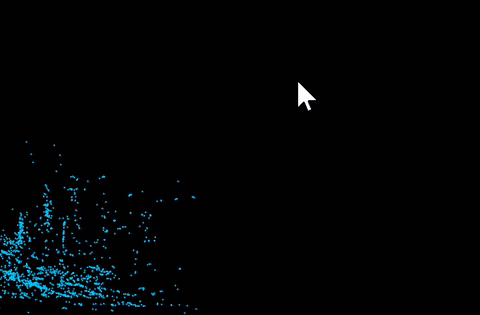

# 实验 1：图形学开发工具--引力粒子系统
202411030025 王劭勋 25AI

本实验实现了一个基于万有引力原理的粒子系统，模拟了粒子之间的引力作用和运动。用户可以通过鼠标拖动来改变粒子的位置，观察粒子之间的引力交互效果。
## 1.项目结构
```
/src/Work0/
├── config.py        # 配置文件，包含物理系统参数和渲染系统参数
├── main.py          # 主程序，包含初始化、主循环
├── physics.py       # 物理模拟类，实现了万有引力计算和粒子运动更新
```
### 核心逻辑
- `physics.py`：实现了万有引力计算和粒子运动更新的核心逻辑。
  - `init_particles()`：初始化每一个粒子的随机坐标。
  - `update_particles(mouse_x, mouse_y)`：根据鼠标位置计算粒子的引力作用和运动更新。
    - 计算方向与距离：根据鼠标位置和粒子位置计算方向向量和距离。
    - 施加引力与阻力：根据方向向量和距离计算引力作用，同时考虑阻力。
    - 边框碰撞检测：检测粒子是否超出边框，若超出则反弹。
- `main.py`：主程序，包含初始化、更新和渲染循环。
  - `run()`: 主程序入口，初始化GUI窗口、无限循环读取鼠标坐标、调用`physics.py`中的函数。
  

## 2.环境管理
本项目使用uv进行全局环境管理，根目录下的uv.lock和pyproject.toml文件包含了项目的依赖信息。需要克隆整个项目以包含它们。
```
git clone https://github.com/Fufuz-jiushijie/CG-labs.git
uv sync
uv run -m src.Work0.main
```

## 3.运行效果
