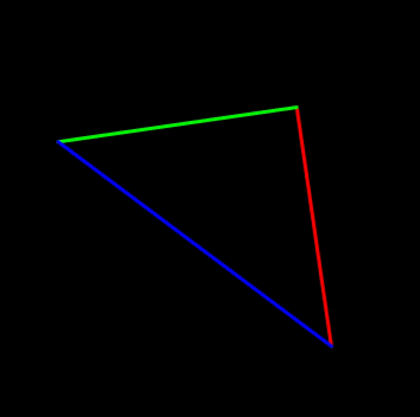
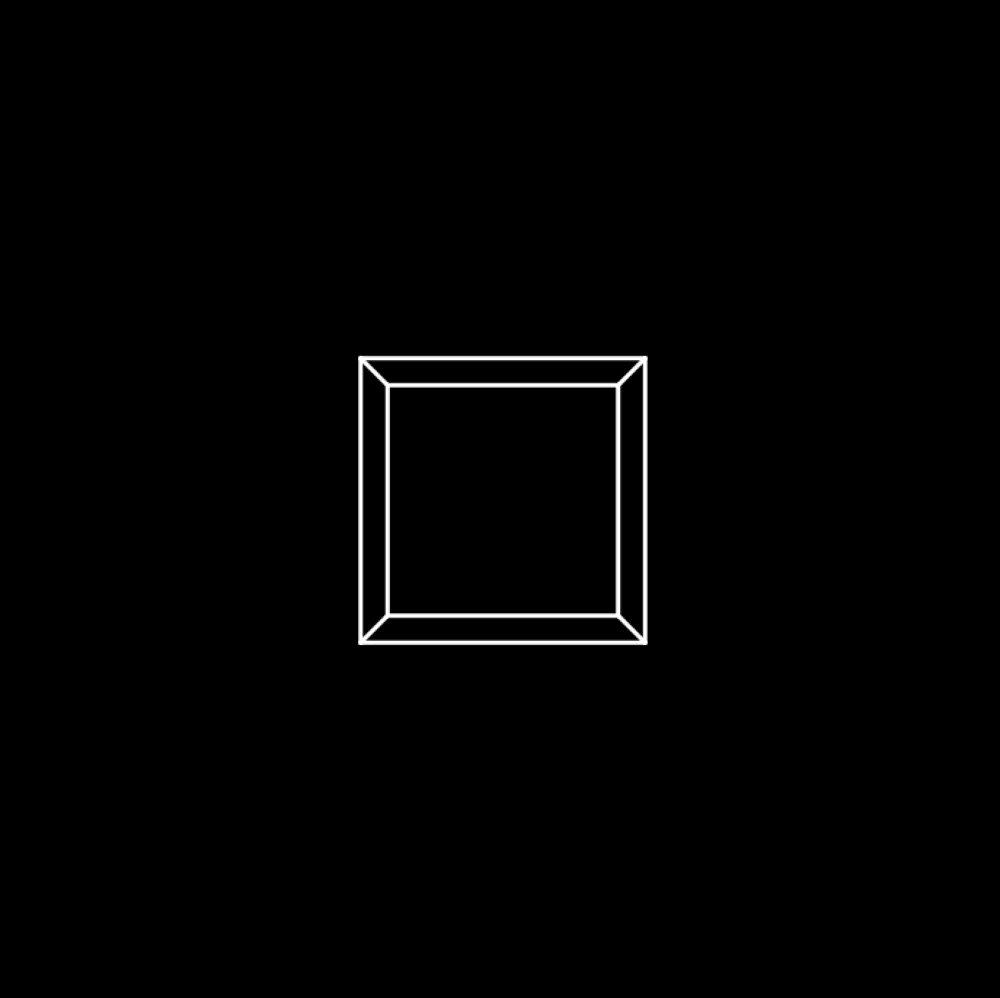
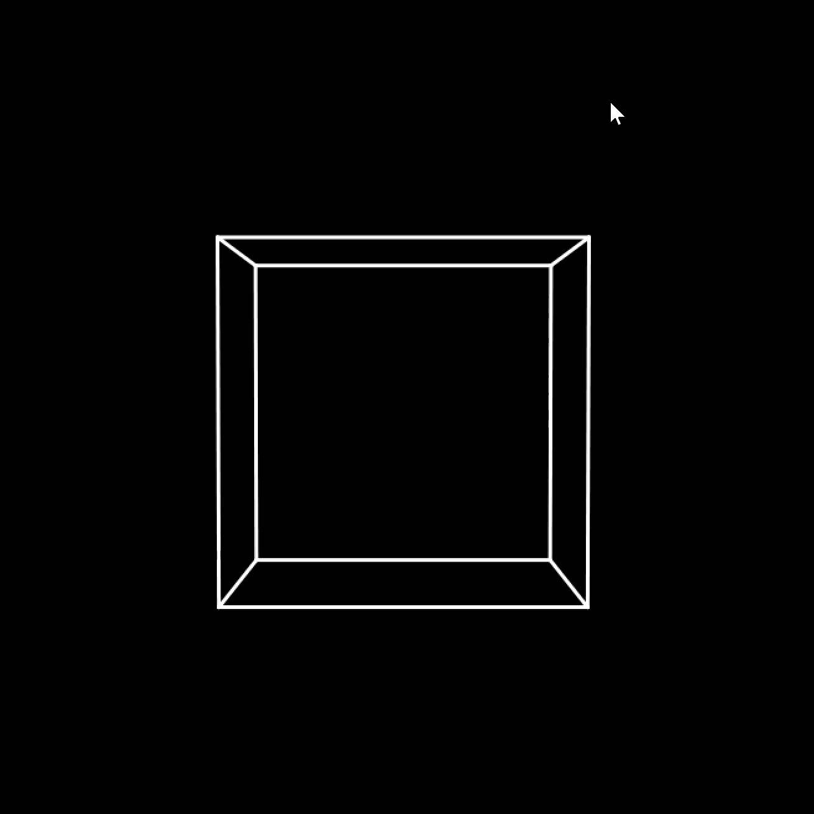
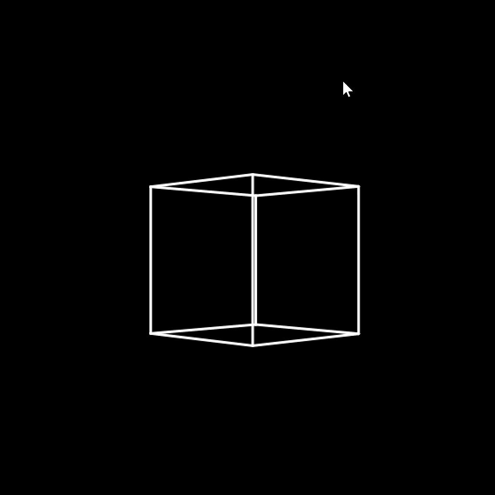
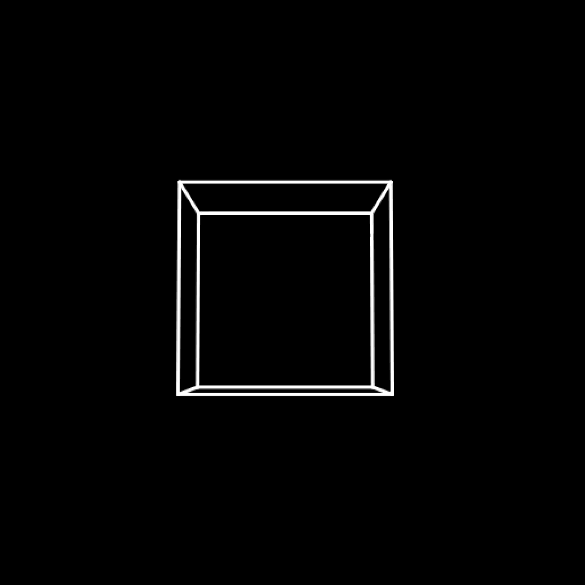
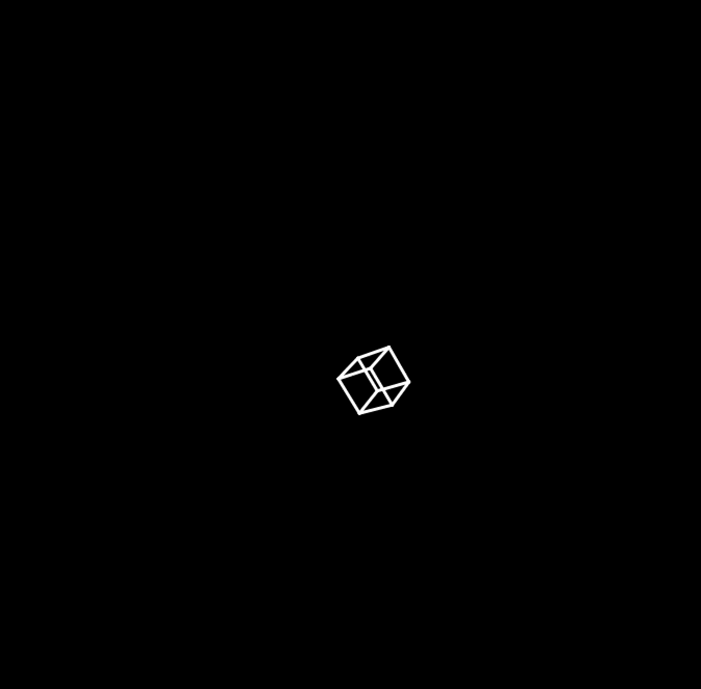
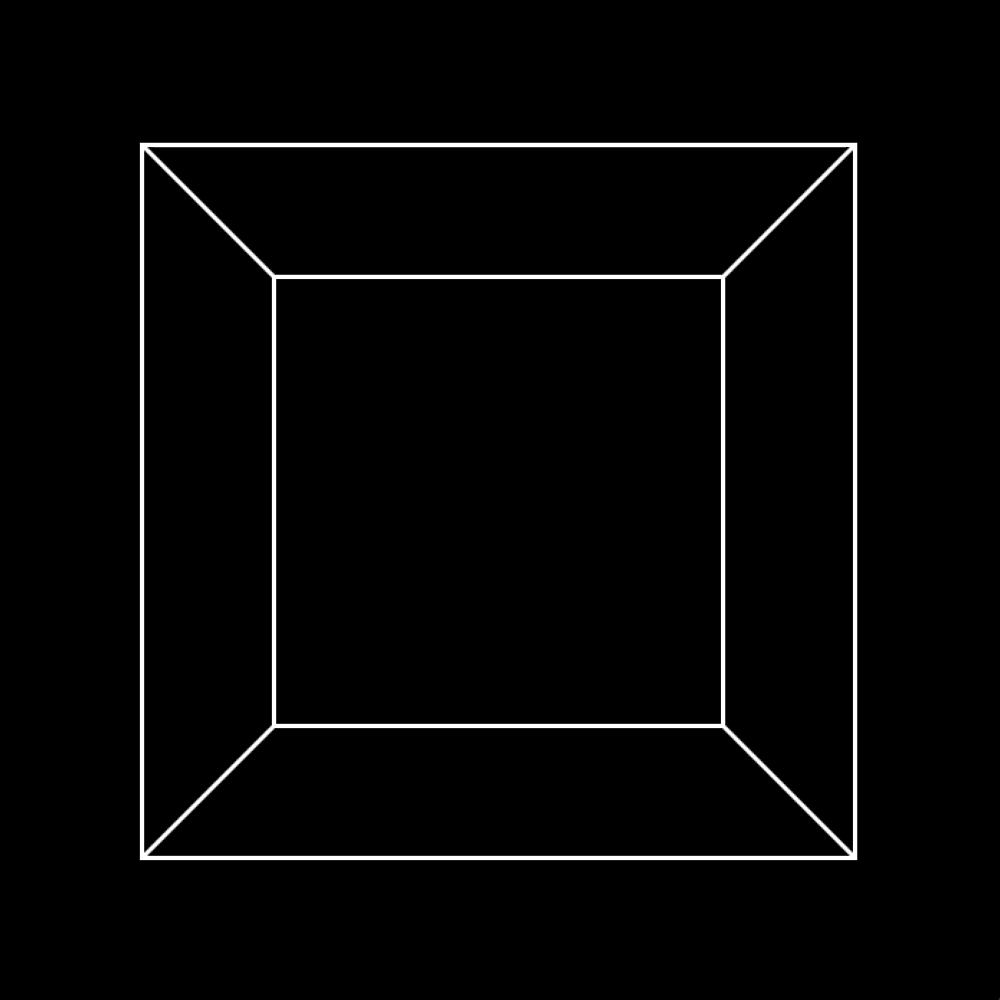
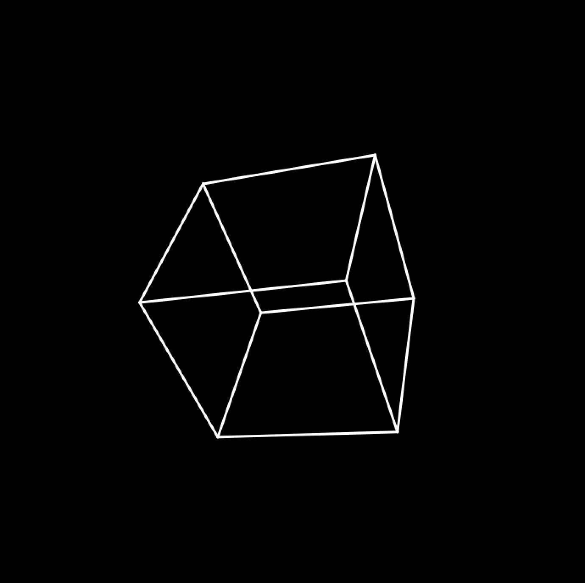

# CG实验2：🧊 Taichi 3D Rendering Pipeline: From Math to Pixels

本项目完全通过底层的线性代数与矩阵运算，手写实现经典的 MVP (Model-View-Projection) 变换、齐次坐标系映射以及透视除法。
将其应用于平面三角形和空间正方体两个案例，搭建渲染流水线并展示效果。

# 📐 核心架构：渲染流水线

由于设备限制，本项目以笔记本 CPU 为内核，完整模拟了顶点处理流程：

- 局部坐标系 $\xrightarrow{\text{Model}}$
- 世界坐标系 $\xrightarrow{\text{View}}$
- 眼睛坐标系 $\xrightarrow{\text{Projection}}$
- 带 $w$ 的设备坐标系 $\xrightarrow{\text{Perspective Divide}}$
- 归一化设备坐标 $\xrightarrow{\text{Viewport}}$
- 屏幕显示

## 🎬 效果展示与数学原理

### 案例1:平面三角形
<div align="center">

</div>
按a绕z轴逆时针转，按d绕z轴顺时针转。数学原理是修改模型矩阵中的旋转矩阵的参数。
<br />
数据流动：  
在main函数中init了ti后端，初始化原始顶点和屏幕顶点Vectorfield。并实例化RenderState类为state，
这个类用来管理输入给核心计算函数compute_transform函数的实参值，并提供默认值。  
然后根据这次要跑三角形还是正方体，修改RenderState类的shape_type属性，并给vertices field传入实际值
进入主循环，初始化taichi GUI窗口，然后读取鼠标输入，修改state的属性，传给compute_transform更新screen_coords，显示为屏幕坐标变化。

### 案例2: 三位立方体

在本案例中，将展示修改更多参数的效果，并讲解其数学原理。更详细的数学推导请参考[手写笔记](../../gifs/handwrittennotes_MVP.pdf)

<br />
复合变换效果:

<div align="center">

</div>

## 🎮 操作说明

| 按键    | 功能           |
| ----- | ------------ |
| W / S | 绕 X 轴旋转      |
| Q / E | 绕 Y 轴旋转      |
| A / D | 绕 Z 轴旋转      |
| I / K | 相机前后移动（Z轴）   |
| J / L | 相机左右移动（X轴）   |
| U / O | 相机上下移动（Y轴）   |
| M     | 视角缩小（FOV 减小） |
| N     | 视角扩大（FOV 增大） |
| ESC   | 退出程序         |

### 1. 模型变换

<div align="center">



</div>

👉 视觉效果：Cube 在空间中绕着 X/Y/Z 轴自转，并可以在世界中平移()。

🧠 数学理解：\
由于 $3 \times 3$ 的矩阵只能表达线性变换（如旋转、缩放），无法表达平移。通过引入第四维 $w$，通过 $4 \times 4$ 矩阵将平移转化为高维的剪切变换，实现了仿射变换的矩阵化统一。
在代码中，按照缩放 $\rightarrow$ 旋转 $\rightarrow$ 平移的顺序依次变换 ($M = T \cdot R\_z \cdot R\_y \cdot R\_x \cdot S$)，对应矩阵从右向左依次乘积。这确保了物体的旋转是基于自身的局部坐标轴，避免了平移后旋转，就不饶物体中心转了。

### 2. 视图变换

<div align="center">


</div>

👉 视觉效果：当我们按下按键时，仿佛是相机在 3D 空间中漫游、拉近或环绕 Cube 观察。

🧠 数学理解：\
相机永远固定在世界原点 $(0,0,0)$ 且看向 $-Z$ 轴。所谓的“移动相机”，本质上是构建一个逆平移和逆旋转矩阵，把整个世界（包含 Cube）向着相机期望移动的反方向拉扯。\
通过相机位置 (eye)、目标点 (target) 和参考上方 (up)，利用向量叉乘求出相机的真实右向 $\vec{u}$、正上方 $\vec{v}$ 和前向 $\vec{w}$。将这三个相互正交的单位向量作为行向量填入矩阵，巧妙地利用了“正交矩阵的逆等于其转置”的数学性质，完成了世界坐标系的逆旋转对齐。

### 3. 透视投影变换

<div align="center">

</div>

👉 视觉效果：调整 FOV (视场角) 时，画面产生强烈的广角拉伸或长焦压缩感；距离相机越远的顶点，在屏幕上显得越小。\
🧠 数学理解：\
纯粹的线性矩阵无法进行“除以 Z”的操作。通过将顶点的 $-Z$ 值存入了齐次坐标的 $W$ 分量中（$W\_{clip} = -Z\_{eye}$）。在随后的透视除法 中，所有 $X, Y$ 坐标强制除以 $W$，利用相似三角形原理，完美实现了近大远小。\
为了在除以 $Z$ 之后仍能保留前后遮挡关系，投影矩阵的第三行为设计成输出 $C \cdot Z + D$。经过透视除法后，深度变成了关于 $1/Z$ 的非线性函数，成功将截头角锥体（视锥体）捏扁成了一个标准正方体 $\[-1, 1]^3$。\
FOV 的几何映射：代码中通过修改 fov\_y 并计算 $tan(\frac{fov\_y}{2})$，动态改变了映射到近截面的缩放系数。角度越大，进入矩阵的除数越大，画面呈现广角效果。

## 📁 工程结构

```
src/Work2/
├── main.py              # 主程序入口，GUI 事件处理与渲染循环
├── mvp.py               # 核心计算内核：矩阵变换函数
├── class_renderstate.py # 渲染状态管理类
└── README.md            # 本文档
```

## 🔧 核心参数说明

### 1. RenderState 类 (class\_renderstate.py)

负责管理所有渲染参数，绕过 Taichi Kernel 不支持默认参数的限制。

| 参数             | 类型   | 默认值      | 说明                           |
| -------------- | ---- | -------- | ---------------------------- |
| `shape_type`   | str  | `"cube"` | 渲染形状：`"cube"` 或 `"triangle"` |
| `num_vertices` | int  | 8/3      | 顶点数（自动根据 shape\_type 设置）     |
| `edges`        | list | -        | 边的连接关系（自动设置）                 |

**视图参数 (View)**：

| 参数           | 默认值         | 说明           |
| ------------ | ----------- | ------------ |
| `eye_pos`    | \[0, 0, 5]  | 相机在世界坐标系中的位置 |
| `target_pos` | \[0, 0, -1] | 相机看向的目标点     |
| `up`         | \[0, 1, 0]  | 相机上方向量       |

**模型参数 (Model)**：

| 参数                | 默认值        | 说明                |
| ----------------- | ---------- | ----------------- |
| `translation`     | \[0, 0, 0] | 平移向量              |
| `rotation_angles` | \[0, 0, 0] | 绕 X/Y/Z 轴的旋转角（弧度） |
| `scale`           | \[1, 1, 1] | 各轴缩放比例            |

**投影参数 (Projection)**：

| 参数             | 默认值  | 说明        |
| -------------- | ---- | --------- |
| `fov_y`        | 45°  | 垂直视场角（弧度） |
| `aspect_ratio` | 1.0  | 宽高比       |
| `z_near`       | 0.1  | 近裁剪面      |
| `z_far`        | 50.0 | 远裁剪面      |

### 2. compute\_transform 函数 (mvp.py)

Taichi Kernel，接收参数并执行顶点变换。

```python
def compute_transform(
    vertices: ti.template(),        # 输入：原始顶点 field
    screen_coords: ti.template(),  # 输出：变换后的屏幕坐标
    eye_pos,                       # 相机位置
    target_pos,                    # 目标点
    up,                            # 上方向
    translation,                   # 平移
    rotation_angles,               # 旋转角
    scale,                         # 缩放
    fov_y,                         # 视场角
    aspect_ratio,                  # 宽高比
    z_near,                        # 近裁剪面
    z_far                          # 远裁剪面
)
```

## 🏗️ 工程设计

### 分层架构

```
┌─────────────────────────────────────┐
│        main.py (UI 层)              │
│   - GUI 事件处理                     │
│   - 键盘输入 → RenderState           │
│   - 渲染绘制                         │ 
├─────────────────────────────────────┤
│   class_renderstate.py (状态层)      │
│   - 统一管理所有渲染参数               │
│   - 支持不同形状（立方体/三角形）        │
├─────────────────────────────────────┤
│       mvp.py (计算层)                │
│   - get_model_matrix()              │
│   - get_view_matrix()               │
│   - get_projection_matrix()         │
│   - compute_transform() @ti.kernel  │
└─────────────────────────────────────┘
```

### 设计模式

1. **状态管理**：RenderState 集中管理所有参数，避免参数散落各处
2. **参数化渲染**：通过 `shape_type` 支持多种几何体，代码复用
3. **计算/渲染分离**：mvp.py 专注矩阵运算，main.py 专注交互和绘制
4. **Taichi 优化**：
   - `@ti.func`：封装矩阵运算（可被 Kernel 调用）
   - `@ti.kernel`：入口函数，触发 Taichi 编译
   - `ti.template()`：传递 Field，支持任意顶点数

### Taichi 实践

- **Kernel 入口要少**：每帧调用 Kernel 次数越少越好
- **Func 封装复杂逻辑**：矩阵构建等复杂计算在 `@ti.func` 中完成
- **类型声明必须**：Taichi 是静态编译语言，参数必须声明类型
- **避免 Python 对象**：Kernel 内部不要使用 list、dict 等 Python 对象

### 📝 [手写笔记 - MVP矩阵推导](../../gifs/handwrittennotes_MVP.pdf)
> 点击上方链接查看手写推导PDF。