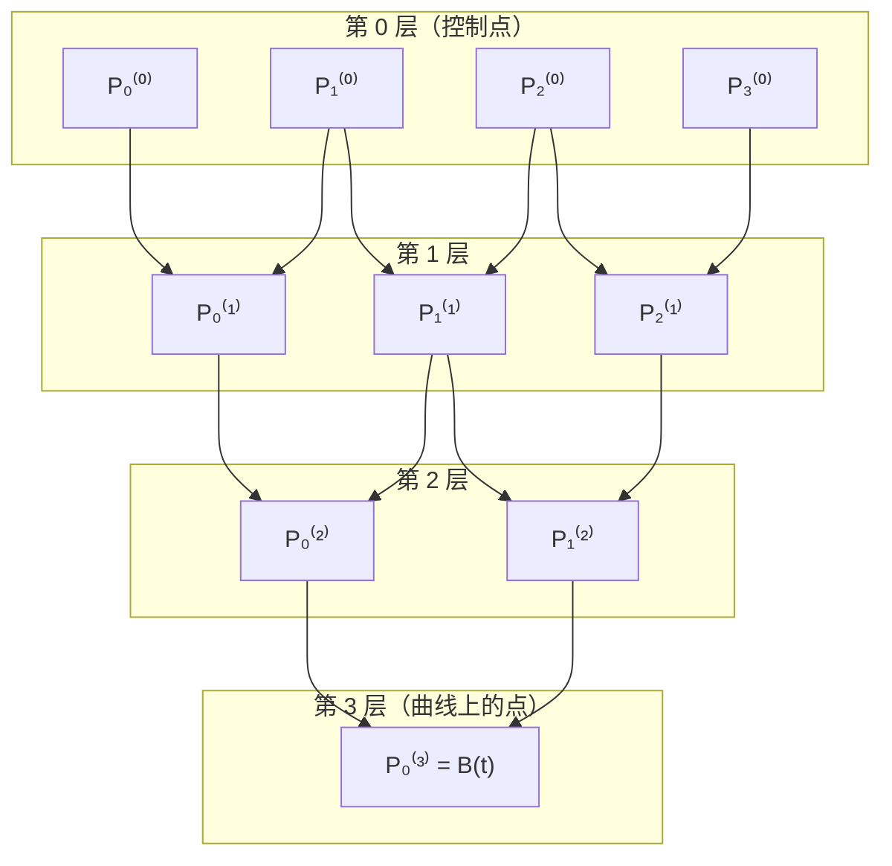
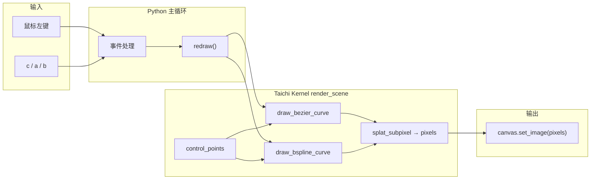
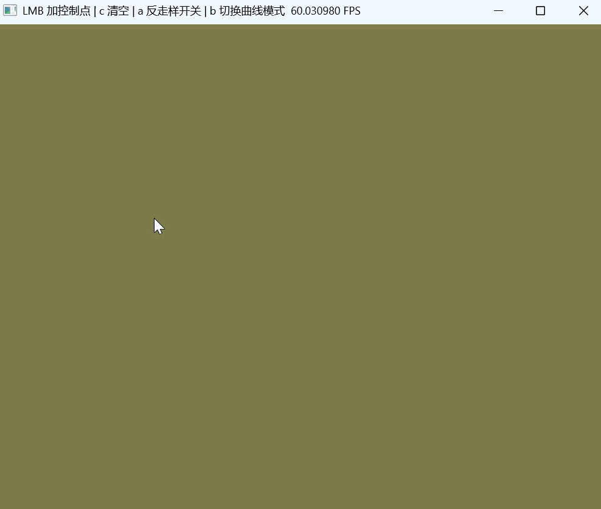
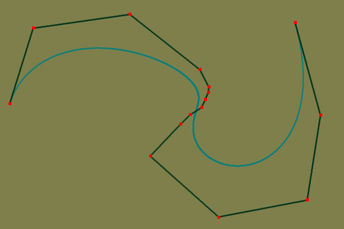
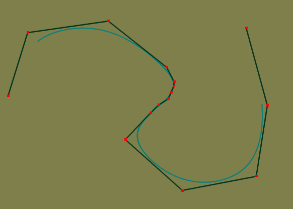

# 实验 3：Bézier 曲线、光栅化与交互（De Casteljau / 反走样 / 均匀三次 B 样条）

本实验在 **Python + Taichi** 下实现：用 **De Casteljau** 求 Bézier 曲线上点、在 **像素场（Field）** 中 **光栅化** 成图像，并通过 **GGUI** 处理鼠标与键盘；在课程选做部分，本仓库还实现了 **3×3 邻域高斯 splat 反走样** 与 **均匀三次 B 样条** 模式切换，便于对比几何行为。

---

## 1. 实验目标

| 目标 | 说明 |
|------|------|
| 几何意义 | 理解 Bézier 曲线由控制多边形“抬升”得到的光滑形状，以及参数 $t\in[0,1]$ 沿曲线扫过的含义。 |
| De Casteljau | 掌握递归线性插值求 $B(t)$ 的算法，并能在代码中实现。 |
| 光栅化 | 理解 **Frame Buffer / 像素场**：将连续几何点映射到离散 $(i,j)$ 并写入颜色。 |
| 交互 | 使用 Taichi GGUI 处理 **左键点击**、**键盘** 等事件。 |
| 选做：反走样 | 亚像素精度下对邻域像素加权混合，减轻阶梯感。 |
| 选做：B 样条 | 均匀三次 B 样条分段矩阵求值，观察 **局部控制** 与 Bézier **全局性** 的差异。 |

---

## 2. 理论：Bézier 与 De Casteljau

### 2.1 定义与参数

给定 $n$ 个控制点 $P_0,\ldots,P_{n-1}$，$n$ 阶（$n-1$ 次）Bézier 曲线常用 Bernstein 形式写为

$$
B(t)=\sum_{k=0}^{n-1} B_k^{n-1}(t)\,P_k,\qquad t\in[0,1],
$$

其中 Bernstein 基

$$
B_k^{m}(t)=\binom{m}{k}t^k(1-t)^{m-k}.
$$

当 $t$ 从 $0$ 连续变到 $1$，$B(t)$ 的轨迹即为所求曲线。

### 2.2 De Casteljau 算法（构造性推导）

**思想**：不直接算 Bernstein 多项式，而在 **控制折线** 上反复做 **相同比例** 的线性插值，最后缩成一点，该点即 $B(t)$。

对固定 $t$，记第 $0$ 层为 $P_i^{(0)}=P_i$。对 $r=1,2,\ldots,n-1$，

$$
P_i^{(r)}=(1-t)P_i^{(r-1)}+t\,P_{i+1}^{(r-1)},\quad i=0,\ldots,n-1-r.
$$

则 $P_0^{(n-1)}=B(t)$。

下图为 $n=4$（三次）时依赖关系的 **三角结构**（De Casteljau 三角），便于与嵌套循环对应：



**复杂度**：对每个 $t$，一层约 $O(n)$ 个插值，共 $n-1$ 层，即 **单点 $O(n^2)$**；本实验在 CPU/GPU 上对 $i=0\ldots N-1$ 采样 $t_i$，总代价随采样数线性放大。

### 2.3 与代码的对应

课程要求可在 **纯 Python** 中实现 `de_casteljau(points, t)`；本仓库 `main.py` 将等价逻辑放在 Taichi 的 `@ti.func de_Casteljau` 中，在 **同一条 kernel** 里与绘制一起执行，便于 GPU 并行（见第 4 节）。

---

## 3. 理论：光栅化与反走样

### 3.1 基础光栅化

连续点 $(x,y)$ 落在浮点平面；屏幕为离散网格 $(i,j)$。本实验坐标系为 **像素坐标**（原点在窗口一角，与 Taichi `get_cursor_pos` 映射一致），写像素即更新 `pixels[i, j]` 的 RGB。

朴素做法：

$$
i=\lfloor x\rfloor,\quad j=\lfloor y\rfloor
$$

只点亮一个像素，会在曲线斜率处出现 **锯齿（走样）**。

### 3.2 选做：邻域距离加权（本仓库实现要点）

几何真实位置带 **亚像素** 小数部分。对以 $\lfloor x\rfloor,\lfloor y\rfloor$ 为参考的 **3×3 邻域**，设像素 $(i,j)$ 中心为 $(i+0.5,j+0.5)$，距离平方 $d^2=(x-i-0.5)^2+(y-j-0.5)^2$，用高斯型权重

$$
w=\exp\left(-\frac{d^2}{2\sigma^2}\right)
$$

与背景色 **Alpha 混合**（实现中用 `old * (1-w) + color * w`），远处像素贡献小，视觉上边缘更平滑。$\sigma$ 控制模糊半径（代码中取 $\sigma^2=0.81$ 量级）。

---

## 4. 理论：均匀三次 B 样条（选做）

### 4.1 动机

Bézier：**全局性**（动一点可能牵动全线），且阶数与控制点数耦合。B 样条通过 **节点向量 + 分段低次多项式** 实现 **局部控制**：修改一个控制点主要影响邻近若干段。

### 4.2 均匀三次 B 样条的一段（矩阵形式）

每 **连续 4 个** 控制点 $P_0,P_1,P_2,P_3$ 对应一段，局部参数 $u\in[0,1]$。标准均匀三次 B 样条可写为

$$
\mathbf{p}(u)=\frac{1}{6}
\begin{bmatrix}1&u&u^2&u^3\end{bmatrix}
\begin{bmatrix}
1&4&1&0\\
-3&0&3&0\\
3&-6&3&0\\
-1&3&-3&1
\end{bmatrix}
\begin{bmatrix}P_0\\P_1\\P_2\\P_3\end{bmatrix},
$$

（与 Cox–de Boor 在均匀三次情形等价；代码中按分量展开为三次多项式系数 `ax, bx, …` 求值。）

若有 $n$ 个控制点且 $n\ge 4$，则共有 **$n-3$** 段；全局参数可按段索引 + 段内 $u$ 分配（本仓库在 kernel 内把全局参数映射到段号与局部 $u$）。

---

## 5. 工程设计

### 5.1 总体数据流



### 5.2 缓冲区与课程要求的对应

课程说明中建议：

- `pixels`：最终图像；
- `curve_points_field`：批量上传采样点；
- `gui_points`：定长对象池画控制点。

本仓库 **实现上** 做如下取舍（便于阅读代码时对照）：

| 课程概念 | 本仓库 `main.py` |
|----------|------------------|
| 800×800 | 分辨率现为 **`RES = (1000, 800)`**，便于宽屏窗口；原理相同。 |
| CPU 算 1000 点 + `from_numpy` | 曲线采样与 De Casteljau 在 **`@ti.kernel` / `@ti.func`** 内完成，避免逐点 CPU→GPU 往返；仍符合 **批量思想**（一次 kernel 内处理所有采样）。 |
| `curve_points_field` | 使用 `curve_points`，采样数为 **`NUM_SEGMENTS`（1000）**，存每条采样（可与调试/后续扩展对接）。 |
| `gui_points` 对象池 | 控制点直接写入定长 `control_points`；未用的槽位填 **$(-1,-1)$**，逻辑上与“池”一致。 |

### 5.3 为何避免“每次一点写 GPUField”

CPU 与 GPU 经 PCIe 通信成本高。若在 Python `for` 里每算一个点就写一次 Field，会产生海量小传输，帧率崩溃。**正确方向**是批量：一次 kernel 内并行处理大量采样（或一次 `from_numpy` 大块上传）。本实现采用 **单次 `render_scene` kernel** 重绘整帧。

### 5.4 绘制顺序（当前实现）

1. `pixels.fill(bg_color)` 清屏。  
2. 若模式为 Bézier 且点数 $\ge 2$：`draw_bezier_curve` — 对 `NUM_SEGMENTS` 个 $t$ 调用 `de_Casteljau`，`splat_subpixel` 写曲线。  
3. 若模式为 B 样条且点数 $\ge 4$：`draw_bspline_curve` — 段映射 + `uniform_cubic_bspline_point`。  
4. 控制多边形：相邻控制点 `draw_line`（同色 splat 逻辑）。  
5. 控制点：`draw_point` 画红色方块邻域。

### 5.5 交互设计

| 输入 | 行为 |
|------|------|
| **鼠标左键** | 在光标处追加控制点（达上限需先 `c` 清空）。 |
| **`c`** | 清空控制点与画布。 |
| **`a`** | 开关 **反走样**（3×3 高斯 splat / 最近像素）。 |
| **`b`** | **Bézier ↔ 均匀三次 B 样条** 切换。 |

---

## 6. 运行方式

在仓库根目录（已配置 `uv`/`python` 环境的前提下）：

```bash
python src/Work3/main.py
```

依赖与版本见仓库根目录 `pyproject.toml` / `uv.lock`。

---

## 7. 效果展示

### 7.1 交互总览

左键添加控制点，控制多边形与曲线实时更新。

<div align="center">

</div>

### 7.2 反走样（`a`）

同一几何下开关 **3×3 高斯反走样**，边缘锯齿与柔和程度的差异。

<div align="center">

</div>

### 7.3 Bézier：全局形状（移动一点牵动整体）

<div align="center">

</div>

### 7.4 均匀三次 B 样条：局部控制

<div align="center">

</div>

### 7.5 静态画面对比

相同控制点下 **Bézier** 与 **B 样条** 对照。

<div align="center">

&nbsp;&nbsp;

</div>

<p align="center"><em>左：bezier.png  右：b-spline.png</em></p>

---

## 8. 与课程实验清单的对应

| 任务 | 状态 / 说明 |
|------|-------------|
| 初始化 Taichi GPU、`pixels`、定长控制点场、采样数 | ✅ |
| De Casteljau | ✅（`de_Casteljau`） |
| GPU kernel 内批量采样 + 越界检查 | ✅（`render_scene` / `splat_subpixel`） |
| GGUI 主循环、左键加点、`c` 清空 | ✅ |
| 控制多边形 + 曲线颜色区分 | ✅（灰线 / 青绿曲线 / 红点） |
| 选做：反走样 | ✅（`a`） |
| 选做：均匀三次 B 样条 + 模式切换 | ✅（`b`，$n\ge 4$ 才有曲线） |

---

## 9. 参考文献与扩展阅读

- Farin, *Curves and Surfaces for CAGD*
- Taichi 文档：[Fields](https://docs.taichi-lang.org/docs/field)、[GUI](https://docs.taichi-lang.org/docs/gui)

---
