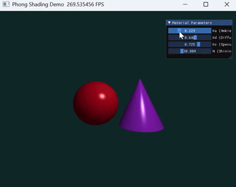

# 实验 4：Phong 光照模型（Taichi GPU 光线追踪）

本实验在 **Taichi GPU** 上实现 **Whitted 风格的一次反弹光线追踪**：主射线与场景求交后计算 **Phong 光照**（环境光 + 漫反射 + 高光），场景包含 **球体** 与 **圆锥**，并在 GGUI 中实时调节材质系数。

---

## 1. 实验目标

| 目标 | 说明 |
|------|------|
| 射线—几何求交 | 球体、竖直圆锥（二次方程 + 高度范围裁剪） |
| Phong 模型 | `Ka` / `Kd` / `Ks` / `shininess` 四项可调 |
| 最近交点 | 多物体取最小正 `t` |
| 实时交互 | 滑块调节环境光、漫反射、镜面强度与高光指数 |

---

## 2. 场景与光照

分辨率 **800×600**。摄像机 `(0, 0, 5)`，主射线方向由像素坐标生成。

| 物体 | 几何 | 基色 |
|------|------|------|
| 左球 | 中心 `(-1.2, -0.2, 0)`，半径 1.2 | 红色 |
| 右圆锥 | 顶点 `(1.2, 1.2, 0)`，底面 `y=-1.4`，底半径 1.2 | 紫色 |
| 背景 | 未击中 | 深青 `(0.05, 0.15, 0.15)` |

固定点光源 `(2, 3, 4)`。击中点后：

- **环境光**：`Ka × light_color × hit_color`
- **漫反射**：`Kd × max(N·L, 0) × ...`
- **镜面**：`Ks × max(R·V, 0)^N`（`R` 为反射方向，`V` 为视线）

---

## 3. 项目结构

```
src/Work4/
├── main.py      # 求交、Phong 着色、GGUI
└── README.md
```

---

## 4. 环境与运行

```bash
uv sync
uv run -m src.Work4.main
```

### 操作说明（Material Parameters）

| 滑块 | 含义 |
|------|------|
| Ka (Ambient) | 环境光系数 |
| Kd (Diffuse) | 漫反射系数 |
| Ks (Specular) | 镜面反射系数 |
| N (Shininess) | 高光指数（1–128） |

---

## 5. 效果展示

调节 Phong 材质参数：

<div align="center">

</div>

---

## 6. 与课程知识点的对应

| 知识点 | 本仓库实现 |
|--------|------------|
| 射线—曲面求交 | `intersect_sphere` / `intersect_cone` |
| Phong 光照 | `render()` 内核中 ambient + diffuse + specular |
| 反射向量 | `reflect(-L, N)` |
| GPU 逐像素渲染 | `@ti.kernel def render()` |

---

## 7. 参考文献

- Phong, *Illumination for Computer Generated Pictures* (1975)
- [Taichi 文档](https://docs.taichi-lang.org/)

---
