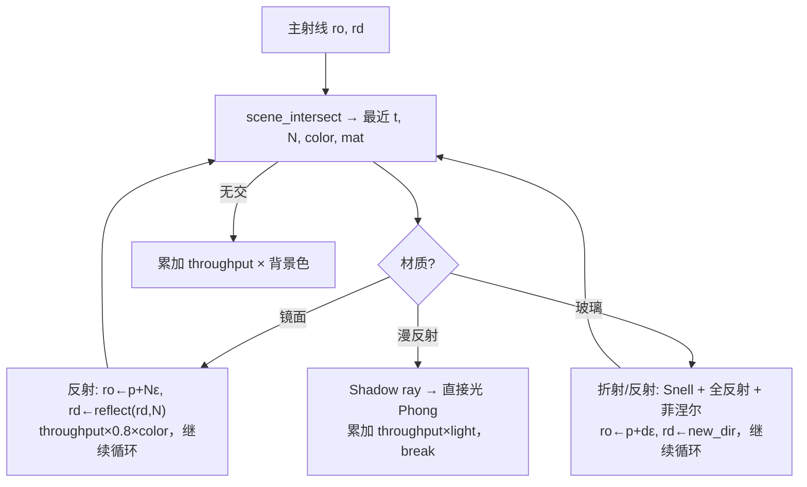
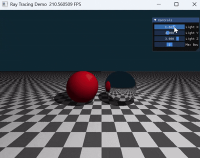

# 实验 5：Whitted 风格光线追踪（Taichi GPU）

本实验在 **Taichi GPU** 上实现简化版 **Whitted 光线追踪**：主射线与场景求交后，按材质分支处理 **镜面反射 / 玻璃折射 / 漫反射 + 硬阴影**，通过迭代式「弹射」模拟多 bounce，并在 GGUI 中实时调节光源、反弹次数、采样数与折射率。

在基础版本之上，本实验完成两项选做：

1. **折射与玻璃材质**：引入斯涅尔定律计算透射方向，处理全反射，并用菲涅尔近似混合反射/折射，把左球改为玻璃。
2. **抗锯齿（MSAA）**：每个像素内随机发射多条主射线并对结果取平均，消除边缘锯齿。

---

## 1. 实验目标

| 目标 | 说明 |
|------|------|
| 射线—几何求交 | 球体（二次方程）、水平平面（棋盘格纹理） |
| Whitted 追踪 | 镜面/玻璃继续弹射；漫反射计算直接光后终止主射线 |
| 硬阴影 | 向光源发射 shadow ray，判断遮挡 |
| 玻璃折射 | 斯涅尔定律 + 全反射 + 菲涅尔反射/折射混合 |
| 抗锯齿 | 每像素多次亚像素采样后取平均 |
| 实时交互 | 滑块调节光源、反弹次数、采样数、折射率 |

---

## 2. 场景与材质

分辨率 **800×600**。摄像机位于 `(0, 1, 5)`，视线略向下。

| 物体 | 几何 | 材质 | 外观 |
|------|------|------|------|
| 左球 | 中心 `(-1.2, 0, 0)`，半径 1 | 玻璃 `MAT_GLASS` | 透明，折射率默认 1.5 |
| 右球 | 中心 `(1.2, 0, 0)`，半径 1 | 镜面 `MAT_MIRROR` | 银色，反射率约 0.8 |
| 地面 | `y = -1` 平面 | 漫反射 | 棋盘格（按 `x,z` 奇偶交替灰/白） |

背景色为深蓝 `(0.05, 0.15, 0.2)`。未击中物体时累加背景并结束该像素追踪。

---

## 3. 追踪流程



**实现要点**（与 `main.py` 一致）：

- 用 **for 循环** 代替递归（Taichi kernel 内不宜递归）。
- 交点处沿法线偏移 `1e-4`，避免 **自相交（shadow acne）**。
- 漫反射仅算 **环境光 + 漫反射直接光**（Whitted 经典路径，无间接漫反射多次弹射）。
- `throughput` 表示光线携带的能量，镜面/玻璃每次乘以各自的颜色衰减。

---

## 4. 选做原理

### 4.1 折射与玻璃材质（斯涅尔定律）

光线穿过两种介质的分界面时会改变方向，弯折程度由两侧折射率决定，这就是**斯涅尔定律**：

$$
n_1 \sin\theta_1 = n_2 \sin\theta_2
$$

其中 $\theta_1$ 是入射角、$\theta_2$ 是折射角，$n_1, n_2$ 是两侧介质的折射率（空气 ≈ 1.0，玻璃 ≈ 1.5）。已知入射方向 $\mathbf{I}$（单位向量，指向表面）和表面法线 $\mathbf{N}$（与 $\mathbf{I}$ 相对），记 $\eta = n_1/n_2$、$\cos\theta_1 = -\mathbf{I}\cdot\mathbf{N}$，透射方向的向量形式为：

$$
\mathbf{T} = \eta\,\mathbf{I} + \left(\eta\cos\theta_1 - \sqrt{k}\right)\mathbf{N},\qquad k = 1 - \eta^2\left(1 - \cos^2\theta_1\right)
$$

这里 $k$ 恰好等于 $\cos^2\theta_2$。

**全反射（Total Internal Reflection）**：当光线从光密介质射向光疏介质（如玻璃→空气，$\eta>1$）且入射角足够大时，上式中的 $k<0$，意味着 $\sin\theta_2>1$ 无解——折射光根本无法穿出，全部能量被反射回介质内部。代码里只要判断 $k<0$，就改用反射方向处理。

**进入还是离开**：球体既有外表面也有内表面。通过 $\mathbf{I}\cdot\mathbf{N}$ 的符号判断：小于 0 说明从外面射入（空气→玻璃，$\eta=1/1.5$）；大于 0 说明射线在玻璃内部、正要穿出（玻璃→空气，$\eta=1.5$），此时把法线翻转再代入公式。

**菲涅尔与随机选择**：真实玻璃在每个点上**既反射也折射**，比例由菲涅尔方程决定（掠射角下反射占比急剧升高，这就是为什么玻璃边缘像镜子）。这里用 **Schlick 近似** 估计反射比例：

$$
R(\theta) = R_0 + (1-R_0)(1-\cos\theta)^5,\qquad R_0=\left(\frac{n_1-n_2}{n_1+n_2}\right)^2
$$

由于本追踪器是单路径结构（一次只跟一条光线），无法同时分裂出反射和折射两条。解决办法是**随机抽样**：每次按菲涅尔比例 $R$ 掷一次随机数，决定这条光线走反射还是折射。单条光线看是随机的，但配合 MSAA 的多次采样平均，最终就能还原出正确的反射/折射混合效果。

### 4.2 抗锯齿（MSAA / 超采样）

锯齿的根源是**采样不足**：原本每个像素只在中心发射一条主射线，物体边缘要么完全命中、要么完全错过，于是边界呈现出阶梯状的硬像素。

解决办法是**在一个像素方格内随机发射多条主射线**（亚像素抖动 $i+\text{rand}$、$j+\text{rand}$），分别追踪后把颜色**取平均**。这样落在边缘上的像素就会得到“部分命中物体、部分命中背景”的中间色，边界过渡变得平滑。采样数越多越平滑，但开销线性增长。这种“每像素多采样取平均”就是超采样抗锯齿（本质同 MSAA 的边缘平滑思路）。

> 这一机制还顺带为玻璃的菲涅尔随机抽样去噪：每像素多条样本既平滑了几何边缘，也平滑了反射/折射的随机选择。

---

## 5. 项目结构

```
src/Work5/
├── main.py      # 求交、追踪 kernel、GGUI 主循环
└── README.md
```

---

## 6. 环境与运行

依赖仓库根目录 `pyproject.toml` 中的 **taichi**（`ti.init(arch=ti.gpu)`，Windows 上通常为 CUDA/Vulkan，macOS 为 Metal）。

```bash
# 仓库根目录
uv sync
uv run -m src.Work5.main
```

### 操作说明

窗口右侧 **Controls** 子窗口：

| 控件 | 作用 |
|------|------|
| Light X / Y / Z | 点光源位置 |
| Max Bounces | 最大弹射次数（1–10），玻璃需较大值才能完整穿透 |
| Samples (AA) | 每像素采样数（1–16），越大边缘越平滑 |
| Glass IOR | 玻璃折射率（1.0–2.5），越大弯折越强 |

---

## 7. 效果展示与调参

### 7.1 基础版本：光源与反弹次数

<div align="center">

</div>

拖动光源 `(x,y,z)` 可见硬阴影随之移动、漫反射明暗面随光照方向变化；增大 `Max Bounces` 时镜面球里的反射层数增多。

### 7.2 折射率 IOR（选做 1）

<div align="center">

</div>

左球为玻璃。拖动 **Glass IOR**：

- **IOR ≈ 1.0**：玻璃与空气折射率几乎相同，光线穿过几乎不弯折，玻璃球近乎“隐形”——只能从轻微的边缘菲涅尔反射看出它的存在。
- **IOR 增大（→ 1.5、1.9）**：弯折越来越强，透过球体看到的棋盘格被明显压缩、扭曲甚至上下翻转（球体起到透镜作用），球的边缘因菲涅尔反射变得越来越像镜面。这正是斯涅尔定律里 $n_1\sin\theta_1=n_2\sin\theta_2$ 的直接体现：两侧折射率差越大，偏折越剧烈。

### 7.3 采样数 Samples（选做 2，抗锯齿）

<div align="center">

</div>

拖动 **Samples (AA)**：

- **采样数低（如 1～2）**：物体边缘出现明显的阶梯锯齿；更突出的是玻璃球表面出现**黑色闪动噪点**——这来自菲涅尔的“随机选反射/折射”，单像素样本太少时随机结果方差大，未能平均掉。
- **采样数高（→ 8、16）**：每像素多条主射线取平均，几何边缘变平滑、玻璃噪点也被同步抹平，画面干净稳定，代价是帧率下降。这说明 MSAA 不仅抗几何锯齿，也为随机采样去噪。

### 7.4 反弹次数对反射/折射的影响

<div align="center">

</div>

拖动 **Max Bounces** 能直观看到 Whitted 追踪的“层数”限制：

- **=1**：两个球**全黑**。因为镜面和玻璃在第一次命中时只生成了二次射线却没机会再追踪（循环已到上限），没有任何颜色被累加。
- **=2**：球体本身能成像了，但**右侧镜面球里反射出来的左侧玻璃球仍是黑的**——反射看到的玻璃又需要额外的弹射去解析它的折射，深度不够就只能显示黑色。
- **继续增大**：玻璃的多重穿透、镜面里的嵌套反射才逐层补全。玻璃至少需要“进入 + 穿出”两次折射，若中间还经过镜面反射则需要更多，因此默认给到 6 较为稳妥。

---

## 8. 与课程知识点的对应

| 知识点 | 本仓库实现 |
|--------|------------|
| 射线—曲面求交 | `intersect_sphere` / `intersect_plane` |
| 最近交点 | `scene_intersect` 取最小 `t` |
| 反射定律 | `reflect(I, N)` |
| 折射 / 斯涅尔定律 | `refract(I, N, eta)` + 全反射判断 |
| 菲涅尔 | Schlick 近似 + 随机选反射/折射 |
| 抗锯齿 | `render()` 内每像素 `num_samples` 次亚像素抖动取平均 |
| Shadow ray | 漫反射分支中 `shadow_ray_orig` |
| GPU 并行渲染 | `@ti.kernel def render()` 逐像素 |

---

## 9. 参考文献

- Whitted, *An Improved Illumination Model for Shaded Display* (CACM 1980)
- Schlick, *An Inexpensive BRDF Model for Physically-based Rendering* (1994)
- [Taichi 文档](https://docs.taichi-lang.org/)

---
