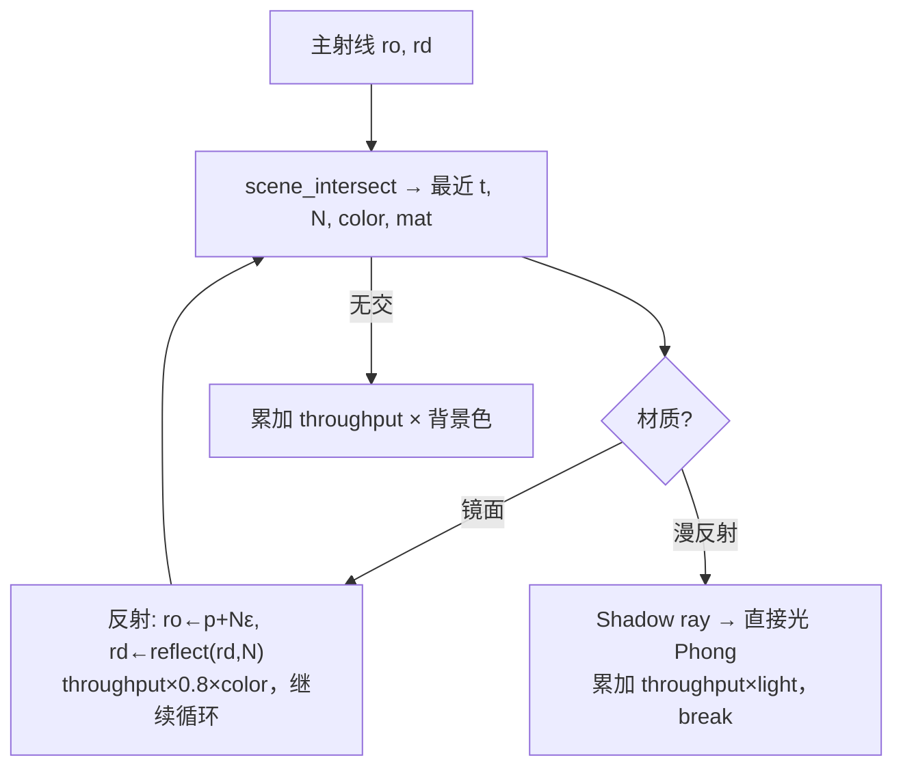

# 实验 5：Whitted 风格光线追踪（Taichi GPU）

本实验在 **Taichi GPU** 上实现简化版 **Whitted 光线追踪**：主射线与场景求交后，按材质分支处理 **镜面反射** 或 **漫反射 + 硬阴影**，通过迭代式「弹射」模拟多 bounce，并在 GGUI 中实时调节光源与最大反弹次数。

---

## 1. 实验目标

| 目标 | 说明 |
|------|------|
| 射线—几何求交 | 球体（二次方程）、水平平面（棋盘格纹理） |
| Whitted 追踪 | 镜面继续反射；漫反射计算直接光后终止主射线 |
| 硬阴影 | 向光源发射 shadow ray，判断遮挡 |
| 实时交互 | 滑块调节光源 `(x,y,z)` 与 `Max Bounces` |

---

## 2. 场景与材质

分辨率 **800×600**。摄像机位于 `(0, 1, 5)`，视线略向下。

| 物体 | 几何 | 材质 | 外观 |
|------|------|------|------|
| 左球 | 中心 `(-1.2, 0, 0)`，半径 1 | 漫反射 `MAT_DIFFUSE` | 红色 |
| 右球 | 中心 `(1.2, 0, 0)`，半径 1 | 镜面 `MAT_MIRROR` | 银色，反射率约 0.8 |
| 地面 | `y = -1` 平面 | 漫反射 | 棋盘格（按 `x,z` 奇偶交替灰/白） |

背景色为深蓝 `(0.05, 0.15, 0.2)`。未击中物体时累加背景并结束该像素追踪。

---

## 3. 追踪流程



**实现要点**（与 `main.py` 一致）：

- 用 **for 循环** 代替递归（Taichi kernel 内不宜递归）。
- 交点处沿法线偏移 `1e-4`，避免 **自相交（shadow acne）**。
- 漫反射仅算 **环境光 + 漫反射直接光**（Whitted 经典路径，无间接漫反射多次弹射）。
- `throughput` 表示光线携带的能量，镜面每次乘以反射率。

---

## 4. 项目结构

```
src/Work5/
├── main.py      # 求交、追踪 kernel、GGUI 主循环
└── README.md
```

---

## 5. 环境与运行

依赖仓库根目录 `pyproject.toml` 中的 **taichi**（`ti.init(arch=ti.gpu)`，Windows 上通常为 CUDA/Vulkan，macOS 为 Metal）。

```bash
# 仓库根目录
uv sync
uv run -m src.Work5.main
```

### 操作说明

窗口右侧 **Controls** 子窗口：

| 控件 | 作用 |
|------|------|
| Light X / Y / Z | 点光源位置 |
| Max Bounces | 最大弹射次数（1–5） |

---

## 6. 效果展示

调节光源与最大反弹次数：

<div align="center">

</div>

---

## 7. 与课程知识点的对应

| 知识点 | 本仓库实现 |
|--------|------------|
| 射线—曲面求交 | `intersect_sphere` / `intersect_plane` |
| 最近交点 | `scene_intersect` 取最小 `t` |
| 反射定律 | `reflect(I, N)` |
| Shadow ray | 漫反射分支中 `shadow_ray_orig` |
| GPU 并行渲染 | `@ti.kernel def render()` 逐像素 |

---

## 8. 参考文献

- Whitted, *An Improved Illumination Model for Shaded Display* (CACM 1980)
- [Taichi 文档](https://docs.taichi-lang.org/)

---
