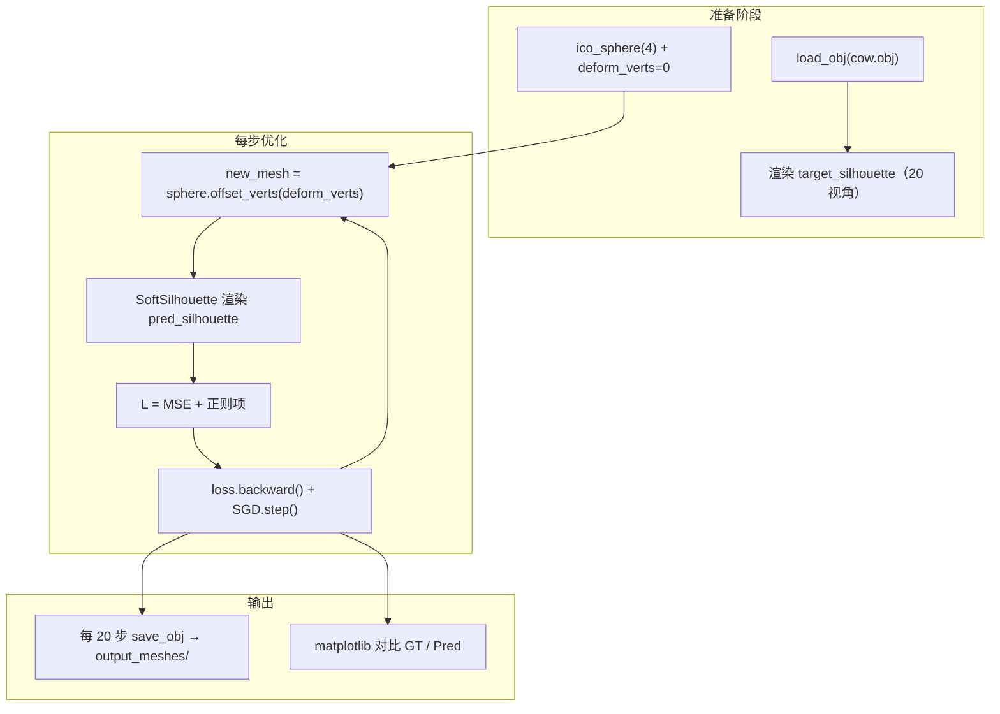
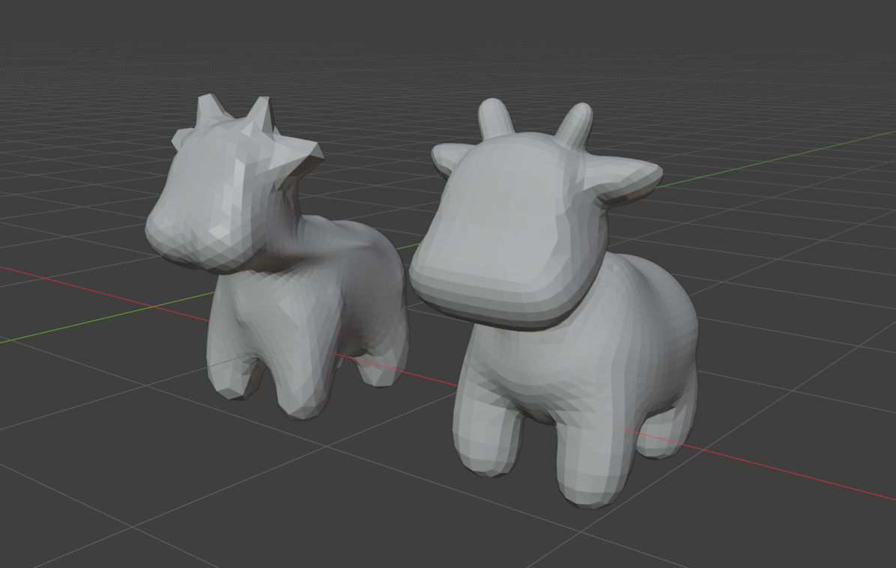
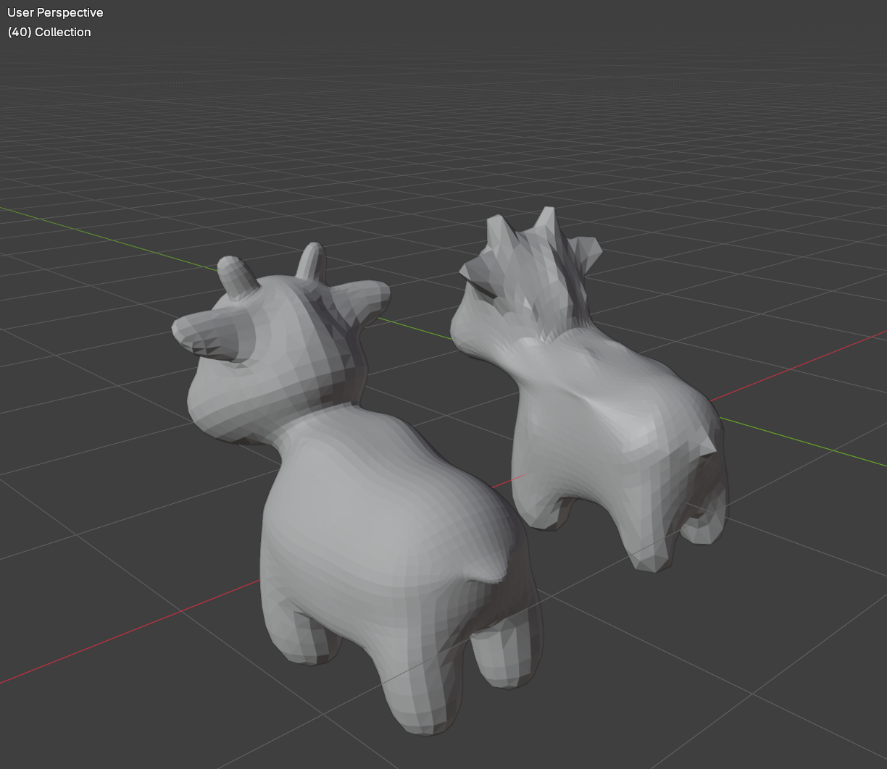

# 实验 6：可微渲染与网格形变优化（PyTorch3D）

本实验在 **PyTorch + PyTorch3D** 下实现 **可微网格渲染**：从多视角 **剪影（silhouette）** 出发，用梯度下降把初始 **二十面体球（ico sphere）** 形变为与目标模型一致的形状。核心思想是：渲染管线对顶点位置可导，因此可以把「2D 图像与目标的差异」反传到 3D 顶点偏移量上。

---

## 1. 实验目标

| 目标 | 说明 |
|------|------|
| 可微渲染 | 理解光栅化 + 软混合如何使离散像素操作近似连续、可求导。 |
| 剪影监督 | 仅用轮廓（alpha 通道）约束 3D 形状，无需纹理或深度真值。 |
| 逆图形学 | 从「观测到的 2D」反推「未知的 3D 几何」，体会 analysis-by-synthesis。 |
| 网格正则 | 在拟合剪影的同时抑制自交、锯齿边与法向突变，保持曲面合理。 |

---

## 2. 理论：为何需要「软」光栅化

经典光栅化在三角形覆盖边界处是 **阶跃函数**（像素要么属于前景要么属于背景），对顶点位置的梯度几乎处处为 0，无法做基于梯度的优化。

PyTorch3D 的 **可微渲染** 通过两项技巧近似连续：

1. **模糊半径（blur radius）**：在三角形边缘附近对多个深度排序的片元做加权，使覆盖率随顶点微小平移而平滑变化。
2. **软剪影着色（Soft Silhouette Shader）**：用 `sigma`、`gamma` 控制概率式混合，输出第 4 通道作为「软 alpha」，作为剪影损失的可导目标。

本仓库中相关超参（与 `main.py` 一致）：

- 图像分辨率：`256×256`
- `blur_radius = log(1/1e-4 - 1) * 1e-4`
- `BlendParams(sigma=1e-4, gamma=1e-4)`
- `faces_per_pixel=50`（每像素保留多条深度片元以正确混合）

---

## 3. 优化问题 formulation

### 3.1 变量与初始化

- **目标网格**：从 `cow.obj` 加载，顶点中心化并缩放到单位尺度，作为 Ground Truth 几何。
- **源网格**：`ico_sphere(4)`，仅优化 **顶点偏移** `deform_verts`（与 `src_mesh` 同形状的可学习张量），等价于在球面上做自由形变。
- **优化器**：`SGD`，学习率 `1.0`，动量 `0.9`，共 `1000` 步。

### 3.2 多视角剪影

在水平方向均匀取 **20 个视角**（方位角从 -180° 到 180°），相机距离约 `2.7`，用 `FoVPerspectiveCameras` + `look_at_view_transform` 生成 `R, T`。

对目标牛模型渲染得到 `target_silhouette`；每一步对当前形变网格渲染得到 `pred_silhouette`，二者在 alpha 通道上对齐。

### 3.3 损失函数

总损失为四项之和：

$$
\mathcal{L} = \mathcal{L}_{\text{sil}} + \lambda_1 \mathcal{L}_{\text{lap}} + \lambda_2 \mathcal{L}_{\text{edge}} + \lambda_3 \mathcal{L}_{\text{normal}}
$$

| 项 | 系数 | 作用 |
|----|------|------|
| **剪影项** `L_sil` | — | 预测与目标剪影的 **MSE**，主监督信号 |
| `mesh_laplacian_smoothing` | 1.0 | 拉普拉斯平滑，避免顶点剧烈抖动 |
| `mesh_edge_loss` | 0.1 | 边长惩罚，抑制拉伸与折叠 |
| `mesh_normal_consistency` | 0.01 | 相邻面法向一致，减轻自交与尖刺 |

表中 `L_sil` 即上式中的 $\mathcal{L}_{\text{sil}}$。

### 3.4 收敛结果（1000 步，末次记录）

在默认超参与 `cow.obj` 目标下，最后一轮（epoch 999）控制台输出为：

| 指标 | 数值 |
|------|------|
| **总 Loss** | **0.0050** |
| **剪影 MSE**（`L_sil`） | **0.0011** |

其余正则项之和约为 $0.0050 - 0.0011 \approx 0.0039$，主要由拉普拉斯平滑贡献。

---

## 4. 程序流程



---

## 5. 项目结构

```
src/Work6/
├── main.py              # 可微渲染 + 优化主程序
├── cow.obj              # 目标模型（需自行放置，与 main.py 同目录）
├── output_meshes/       # 运行后生成：mesh_epoch_000.obj, ...
└── README.md
```

`main.py` 使用相对路径 `"cow.obj"`，请在 **`src/Work6` 目录下** 启动程序，或将 `cow.obj` 放在当前工作目录。

---

## 6. 环境与运行

本实验依赖 **PyTorch** 与 **PyTorch3D**（未写入仓库根目录 `pyproject.toml`，需单独安装）。建议在有 **CUDA** 的机器上运行以加速；代码会自动选择 `cuda:0` 或 `cpu`。

```bash
# 示例：安装 PyTorch3D（请按官方文档选择与 CUDA 匹配的 wheel）
pip install torch torchvision
pip install pytorch3d

pip install matplotlib numpy

cd src/Work6
# 将课程提供的 cow.obj 放在此目录
python main.py
```

也可在 Jupyter 中运行：程序使用 `IPython.display.clear_output` 刷新训练日志，并周期性弹出剪影对比图。

**运行产物**

- `output_meshes/mesh_epoch_XXX.obj`：每 20 步及最后一帧的中间网格，可用 MeshLab / Blender 查看形变过程。
- 控制台：总 Loss、剪影 MSE；图中左为 GT 剪影，右为当前预测。

---

## 7. 效果展示

### 7.1 剪影对比（正面 / 背面）

优化收敛后，多视角剪影与目标的一致性。（每20个 epoch 的 obj 文件在 `../../gifs/Work6/output_meshes/`）

<div align="center">

</div>

<div align="center">

&nbsp;&nbsp;

</div>

<p align="center"><em>左：Two_cow.png  右：TwoCow_back.png</em></p>

---

## 8. 与课程知识点的对应

| 知识点 | 本仓库实现 |
|--------|------------|
| 可微光栅化 / 软剪影 | `MeshRasterizer` + `SoftSilhouetteShader` |
| 多视角几何约束 | 20 个 `FoVPerspectiveCameras` |
| 逆问题与梯度下降 | `deform_verts` + `SGD` |
| 网格先验 / 正则化 | Laplacian、edge、normal consistency |
| 结果导出 | `save_obj` → `output_meshes/` |

---

## 9. 常见问题

| 现象 | 可能原因 |
|------|----------|
| `未找到 cow.obj` | 未将模型放在运行目录，或未 `cd src/Work6` |
| Loss 下降极慢 | CPU 训练；可减小 `num_views` 或 `epochs` 做调试 |
| 网格出现自交或噪声 | 增大拉普拉斯/边长权重，或降低学习率 |
| 安装 PyTorch3D 失败 | 需与 PyTorch、CUDA 版本匹配的预编译包，见 [PyTorch3D 安装说明](https://github.com/facebookresearch/pytorch3d/blob/main/INSTALL.md) |

---

## 10. 参考文献

- Loper & Black, *OpenDR: An Approximate Differentiable Renderer* (ECCV 2014)
- Liu et al., *Soft Rasterizer: A Differentiable Renderer for Image-based 3D Reasoning* (ICCV 2019)
- PyTorch3D 教程：[Fit a mesh via rendered silhouette supervision](https://pytorch3d.org/tutorials/fit_simple_mesh)

---
