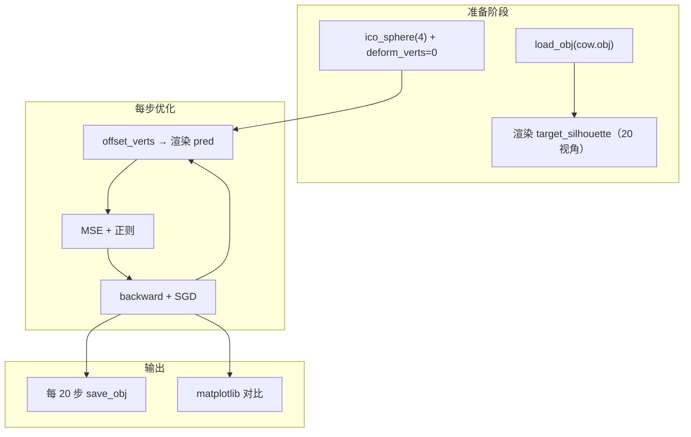
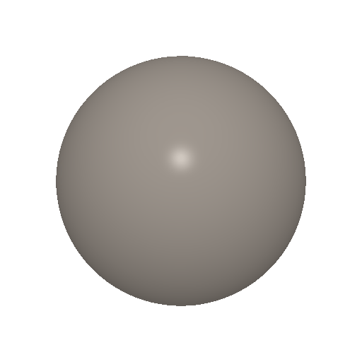

# 实验 6：可微渲染与网格形变优化（PyTorch3D）

本实验在 **PyTorch + PyTorch3D** 下实现 **可微网格渲染**：从多视角 **剪影（silhouette）** 出发，用梯度下降把初始 **二十面体球（ico sphere）** 形变为与目标模型一致的形状。核心思想是：渲染管线对顶点位置可导，因此可以把「2D 图像与目标的差异」反传到 3D 顶点偏移量上。

---

## 1. 实验目标

| 目标 | 说明 |
|------|------|
| 可微渲染 | 理解光栅化 + 软混合如何使离散像素操作近似连续、可求导。 |
| 剪影监督 | 仅用轮廓（alpha 通道）约束 3D 形状，无需纹理或深度真值。 |
| 逆图形学 | 从「观测到的 2D」反推「未知的 3D 几何」，体会 analysis-by-synthesis。 |
| 网格正则 | 在拟合剪影的同时抑制自交、锯齿边与法向突变，保持曲面合理。 |

---

## 2. 理论：为何需要「软」光栅化

经典光栅化在三角形覆盖边界处是 **阶跃函数**（像素要么属于前景要么属于背景），对顶点位置的梯度几乎处处为 0，无法做基于梯度的优化。

PyTorch3D 的 **可微渲染** 通过两项技巧近似连续：

1. **模糊半径（blur radius）**：在三角形边缘附近对多个深度排序的片元做加权，使覆盖率随顶点微小平移而平滑变化。
2. **软剪影着色（Soft Silhouette Shader）**：用 `sigma`、`gamma` 控制概率式混合，输出第 4 通道作为「软 alpha」，作为剪影损失的可导目标。

本仓库中相关超参（与 `main.py` 一致）：

- 图像分辨率：`256×256`
- `blur_radius = log(1/1e-4 - 1) * 1e-4`
- `BlendParams(sigma=1e-4, gamma=1e-4)`
- `faces_per_pixel=50`（每像素保留多条深度片元以正确混合）

---

## 3. 优化问题

### 3.1 变量与初始化

- **目标网格**：从 `cow.obj` 加载，顶点中心化并缩放到单位尺度。
- **源网格**：`ico_sphere(4)`，仅优化顶点偏移 `deform_verts`。
- **优化器**：`SGD`，学习率 `1.0`，动量 `0.9`，共 `1000` 步。

### 3.2 多视角剪影

20 个方位角（-180°～180°），相机距离约 `2.7`，渲染得到 `target_silhouette` 与每步的 `pred_silhouette`。

### 3.3 损失函数

$$
\mathcal{L} = \mathcal{L}_{\text{sil}} + \lambda_1 \mathcal{L}_{\text{lap}} + \lambda_2 \mathcal{L}_{\text{edge}} + \lambda_3 \mathcal{L}_{\text{normal}}
$$

| 项 | 系数 | 作用 |
|----|------|------|
| **剪影项** `L_sil` | — | 预测与目标剪影的 **MSE** |
| `mesh_laplacian_smoothing` | 1.0 | 拉普拉斯平滑 |
| `mesh_edge_loss` | 0.1 | 边长惩罚 |
| `mesh_normal_consistency` | 0.01 | 法向一致性 |

表中 `L_sil` 即上式中的 $\mathcal{L}_{\text{sil}}$。

### 3.4 收敛结果（1000 步，末次记录）

| 指标 | 数值 |
|------|------|
| **总 Loss** | **0.0050** |
| **剪影 MSE**（`L_sil`） | **0.0011** |

其余正则项之和约为 $0.0050 - 0.0011 \approx 0.0039$，主要由拉普拉斯平滑贡献。

---

## 4. 程序流程



---

## 5. 项目结构

```
src/Work6/
├── main.py              # 可微渲染 + 优化
├── make_mesh_gif.py     # 由 output_meshes 合成形变 GIF（ModelScope）
├── cow.obj              # 目标模型（与 main.py 同目录，需自行放置）
├── output_meshes/       # 运行后：mesh_epoch_XXX.obj
└── README.md
```

请在 **`src/Work6` 目录** 下运行 `main.py`，或保证当前工作目录能找到 `cow.obj`。

---

## 6. 环境与运行

### 6.1 本地 / ModelScope 训练

**PyTorch3D 未写入** 根目录 `pyproject.toml`，需在运行环境中单独安装（ModelScope 可用课程提供的 Gitee 源码 `%pip install`）。

```bash
cd src/Work6
# 放置 cow.obj 后
python main.py
```

Jupyter 下使用 `IPython.display.clear_output` 刷新日志；每 20 步保存 `output_meshes/mesh_epoch_XXX.obj`。

**ModelScope 注意**：安装请用 **`%pip`**（不要用 `!pip`）；训练避免仅用 `!python main.py`（子进程有包、内核可能没有）。生成 GIF 前在本 Notebook 执行 `import pytorch3d` 确认无报错。

### 6.2 由 `output_meshes` 生成形变 GIF

```python
%run make_mesh_gif.py
```

脚本按 epoch 顺序加载 OBJ，Phong 固定相机渲染并输出 `Cow_mesh.gif`（详见 `make_mesh_gif.py` 顶部说明）。`HardPhongShader` 需顶点纹理，脚本内已为 OBJ 附加 `TexturesVertex`。

---

## 7. 效果展示

### 7.1 形变过程

<div align="center">

</div>

### 7.2 旋转展示与剪影对比

<div align="center">

</div>

<div align="center">

&nbsp;&nbsp;

</div>

---

## 8. 与课程知识点的对应

| 知识点 | 本仓库实现 |
|--------|------------|
| 可微光栅化 / 软剪影 | `MeshRasterizer` + `SoftSilhouetteShader` |
| 多视角约束 | 20 个 `FoVPerspectiveCameras` |
| 逆问题与梯度下降 | `deform_verts` + `SGD` |
| 网格正则 | Laplacian、edge、normal consistency |
| 中间结果 | `save_obj` → `output_meshes/` |

---

## 9. 常见问题

| 现象 | 处理 |
|------|------|
| `未找到 cow.obj` | 在 `src/Work6` 下运行并放置模型 |
| `No module named pytorch3d'` | 同一内核用 `%pip` 安装；见 §6.1 |
| `Meshes does not have textures`（GIF 脚本） | 使用仓库最新 `make_mesh_gif.py` |
| Loss 很慢 | 使用 GPU；或减少 `num_views` / `epochs` 调试 |

---

## 10. 参考文献

- Loper & Black, *OpenDR* (ECCV 2014)
- Liu et al., *Soft Rasterizer* (ICCV 2019)
- [PyTorch3D：Fit a mesh via silhouette](https://pytorch3d.org/tutorials/fit_simple_mesh)

---
