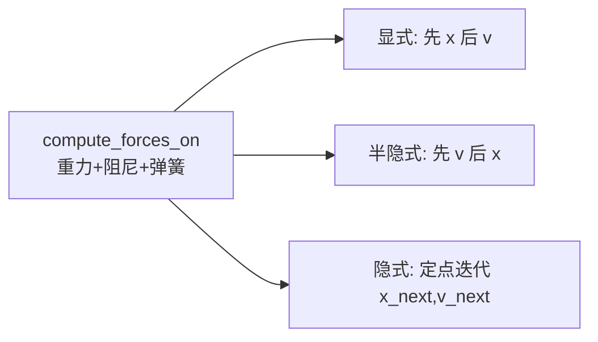

# 实验 7：质点—弹簧布料仿真（Taichi GPU）

本实验在 **Taichi** 上实现 **N×N 质点网格** 的布料物理：对比 **显式欧拉**、**半隐式欧拉**、**隐式欧拉（定点迭代）** 三种时间积分在相同弹簧参数下的稳定性，并用 GGUI 3D 场景实时显示粒子与弹簧线框。

在必做的结构弹簧之外，本实验还完成了**两项选做内容**：

- **完善弹簧模型**：在结构弹簧（Structural）之外补充**剪切弹簧（Shear）**和**弯曲弹簧（Bending）**，可在界面里随时开关，观察布料形态的变化。
- **空间碰撞**：在场景里放一个球体，每步物理更新后判断质点是否进入球内并做碰撞处理，让布料能搭在球面上。

---

## 1. 实验目标

| 目标 | 说明 |
|------|------|
| 质点—弹簧模型 | 结构弹簧连接上下左右邻点，存储自然长度 |
| 力计算 | 重力、阻尼、胡克定律弹簧力（`atomic_add` 累加） |
| 积分器对比 | 显式易爆炸；半隐式稳定；隐式更阻尼、更稳 |
| 边界条件 | 首行两角点固定，模拟悬挂布角 |
| 交互 | 切换积分方法、开关剪切/弯曲弹簧、开关球体碰撞、暂停、重置 |
| 选做·弹簧 | 补充剪切弹簧（抗错切）与弯曲弹簧（抗折叠） |
| 选做·碰撞 | 与球体做距离判断 + 推回球面的简单碰撞 |

---

## 2. 模型与参数

与 `main.py` 一致：

| 参数 | 默认值 | 含义 |
|------|-----|------|
| `N` | 20 | 网格 20×20，共 400 质点 |
| `mass` | 1.0 | 质点质量 |
| `dt` | 5e-4 | 时间步长 |
| `k_s` | 10000 | 结构弹簧劲度 |
| `k_s_shear` | 8000 | 剪切弹簧劲度（略软于结构） |
| `k_s_bend` | 2000 | 弯曲弹簧劲度（更软，只抗折叠） |
| `k_d` | 5.0 | 速度阻尼系数 |
| `gravity` | (0, -9.8, 0) | 重力 |
| `max_velocity` | 50 | 速度钳制，防数值发散 |
| `sphere_center` | (0, 0.3, -0.5) | 碰撞球球心（放在布料悬挂平面上） |
| `sphere_radius` | 0.25 | 碰撞球半径 |
| `collision_margin` | 0.01 | 碰撞留白，避免穿插/闪烁 |

初始布匹在 `y ≈ 0.8` 水平展开；索引 `(i,0)` 且 `i∈{0, N-1}` 的角点 `is_fixed=1`，相当于把一条边的两个角钉住，布料会从这条边垂下来并搭过下方的球。

每帧 **40 个子步**（`40 × dt ≈ 0.02 s`），保证动画速度适中。**这条"40 子步 × dt"的设定也是后面"放慢"现象的关键**（见第 10 节）。

---

## 3. 三种积分方法



| 方法 | 函数 | 特点 |
|------|------|------|
| 0 显式欧拉 | `step_explicit` | `x += v*dt` 再用旧力更新 `v`；大步长下易 **爆炸/撕裂** |
| 1 半隐式欧拉 | `step_semi_implicit` | 先 `v` 后 `x`；刚度较大时仍较稳定（**默认**） |
| 2 隐式欧拉 | `step_implicit_iter` | 对 `x_next,v_next` 做 3 次定点迭代，更阻尼、更稳 |

弹簧力在三种方法中形式相同：沿弹簧方向，大小 `spring_ks * (|d| - L0)`（每根弹簧各自的劲度系数）。

---

## 4. 选做一：弹簧模型（结构 / 剪切 / 弯曲）

只有结构弹簧时，布料只约束了"上下左右相邻点之间的距离"，它能阻止拉伸，却**管不住"歪斜"和"卷折"**：网格容易像平行四边形一样错切（shear），也容易沿网格线无代价地对折（bending）。补上另外两类弹簧后，布料才更像真实织物。

| 弹簧类型 | 连接关系 | 作用 | 代码 |
|----------|----------|------|------|
| 结构 Structural | `(i,j)`—`(i+1,j)`、`(i,j)`—`(i,j+1)` | 抗拉伸，撑出基本网格 | 始终启用 |
| 剪切 Shear | 两条对角线 `(i,j)`—`(i+1,j±1)` | 抗错切，避免网格歪成平行四边形 | `enable_shear` |
| 弯曲 Bending | 隔一个点 `(i,j)`—`(i+2,j)`、`(i,j)`—`(i,j+2)` | 抗折叠，让布面更挺、褶皱更大 | `enable_bending` |

三类弹簧统一存进同一组数组，并各带一个 `spring_ks`（结构 10000 / 剪切 8000 / 弯曲 2000），力的计算逻辑完全一样，只是劲度不同。`init_springs(enable_shear, enable_bending)` 用两个整型开关决定是否生成后两类弹簧；界面按钮可随时开关并**重建弹簧**，直接观察布料形态变化：

- **只有结构弹簧**：布面偏"软"，容易歪斜、贴着球面塌下去。
- **加上剪切**：网格不再轻易错切，布料更有"织物感"。
- **再加弯曲**：布面更挺括，搭在球上时褶皱更圆润、不容易尖锐对折。

---

## 5. 选做二：球体碰撞

在布料悬挂平面上（`(0, 0.3, -0.5)`）放一个半径 `0.25` 的球。每个物理子步更新完位置后调用 `handle_sphere_collision`：

1. 计算质点到球心的距离 `dist`；
2. 若 `dist < radius + margin`（进入球内/贴面），把质点沿法线 `n` **投影回球面外侧**：`pos = center + n*(radius+margin)`；
3. 去掉**指向球心**的那部分速度（`vn = v·n`，若 `vn<0` 则 `v -= vn*n`），避免下一步又扎进去。

这样布料下落后会被球"托住"并自然搭在上面。开关按钮 `Sphere Collision` 通过整型参数 `collide` 传入各 `step_*` kernel，关掉后布料直接穿过球继续下垂，方便对比。

> 实现上把"是否启用"做成 kernel 的整型参数、判断写在每质点循环内部，这样顶层 `for` 仍能被 Taichi 并行，不会因为 `if` 包住整段循环而退化成串行。

---

## 6. 项目结构

```
src/Work7/
├── main.py      # 初始化、三类弹簧、球体碰撞、三种 step kernel、GGUI 主循环
└── README.md
```

---

## 7. 环境与运行

```bash
uv sync
uv run -m src.Work7.main
```

### 操作说明（Control Panel）

| 按钮 | 作用 |
|------|------|
| Explicit Euler (Explosive) | 切换到显式积分并 **重置** 布料 |
| Semi-Implicit Euler (Stable) | 半隐式（推荐演示） |
| Implicit Euler (Damped) | 隐式定点迭代 |
| [x] Shear Springs | 开关剪切弹簧（切换后重建弹簧） |
| [x] Bending Springs | 开关弯曲弹簧（切换后重建弹簧） |
| [x] Sphere Collision | 开关球体碰撞 |
| Pause / Resume | 暂停或继续仿真 |
| Reset Cloth | 重新 `init_cloth()` |

**视角**：按住 **鼠标右键** 拖动旋转相机；滚轮缩放（`track_user_inputs`）。

---

## 8. 效果展示

`gifs/Work7/` 下的录屏对应不同参数设置（文件名标出了关键参数）：

### 8.1 默认参数：稳定下垂

`k_d=5, dt=5e-4`（与代码默认一致）。阻尼较大，布料下落后很快收敛、稳稳搭住，不再来回晃。

<div align="center">

</div>

### 8.2 减小阻尼：摆动更久

`k_d=1`。阻尼变小后能量耗散慢，布料摆动幅度更大、晃动持续更久，更"飘"。对比 8.1 可直观看到阻尼系数对收敛快慢的影响。

<div align="center">

</div>

### 8.3 减小时间步长：画面变慢（慢动作）

`k_d=1, dt=5e-5`。把 `dt` 缩小到 1/10，而每帧子步数（40）不变，于是**每帧推进的物理时间也变成 1/10**，看起来就像慢放（原理见第 10 节）。

<div align="center">

</div>

### 8.4 显式欧拉数值爆炸（慢放观察）

`k_d=1, dt=1e-5, Explicit Euler`。这里**故意把 `dt` 调到极小**，目的不是为了稳定，而是把显式欧拉的"爆炸"过程放慢、拉长到很多帧，方便逐帧看清布料是怎样一步步抖动、拉长、最终乱飞撕裂的（原理见第 9 节）。

<div align="center">

</div>

### 8.5 选做：剪切弹簧 + 球体碰撞

开启剪切弹簧（布面更有织物感、不易错切）并打开球体碰撞，布料下落后被球托住、自然搭在球面上（对应第 4、5 节）。

<div align="center">

</div>

---

## 9. 显式欧拉为什么会数值爆炸？

弹簧系统本质是一组**谐振子**：对单根弹簧，恢复力 ≈ `-k·x`，可写成 `x'' = -ω²x`，其中 `ω = √(k_s/m)`。把它用不同欧拉法离散，稳定性完全不同。

**显式（前向）欧拉**用的是**这一步开头**的速度和力：

```text
x_{n+1} = x_n + v_n · dt
v_{n+1} = v_n + (f(x_n)/m) · dt   # 力仍取旧位置
```

对谐振子做特征分析，显式欧拉每步的"放大系数"模长为

```text
|放大系数| = √(1 + (ω·dt)²)  > 1   （只要 ω、dt 不为 0，恒大于 1）
```

也就是说，**每走一步都会往系统里多注入一点能量**，振幅按 `(√(1+(ω·dt)²))^步数` 几何增长。再加上弹簧力和形变成正比形成的**正反馈**——某根弹簧被拉长 → 力变大 → 把质点推得更远 → 下一步形变更大——速度和位置很快发散，表现为顶点乱飞、网格被拉爆/撕裂。

关键点：

- `k_s` 越大（布越"硬"）→ `ω` 越大 → 增长越快，越容易炸；本实验 `k_s=10000` 属于"很硬"。
- 减小 `dt` 只能**减慢**增长速度，**不能根治**：放大系数始终 `>1`，所以 8.4 里即使 `dt=1e-5`，布料最终还是会炸，只是炸得"慢"，便于观察。
- 代码里的 `max_velocity` 速度钳制只是"封顶"让画面不至于瞬间飞到无穷远，并不能阻止系统持续吸收能量、走向发散。

**半隐式（辛）欧拉**则是先更新速度、**再用新速度更新位置**：

```text
v_{n+1} = v_n + (f(x_n)/m) · dt
x_{n+1} = x_n + v_{n+1} · dt      # 用新速度
```

它是辛积分，长期近似守恒能量，只要 `dt < 2/ω` 就稳定。这里 `ω = √(10000/1) = 100`，稳定上限约 `dt < 0.02`，而默认 `dt=5e-4` 远在稳定区内——这正是默认用半隐式、且它能稳稳收敛的原因。隐式欧拉则会主动耗散能量，更"黏"更稳。

---

## 10. 为什么减小时间步长会让放映变慢？

仿真的推进节奏由主循环写死：**每渲染一帧，固定跑 40 个物理子步，每个子步把仿真时间向前推进 `dt`**。所以：

```text
每帧推进的仿真时间 = 子步数 × dt = 40 × dt
每秒画面推进的仿真时间 = 帧率 × 40 × dt
```

默认 `dt=5e-4` 时，每帧推进 `40 × 5e-4 = 0.02 s` 仿真时间，和真实时间大致同步，看起来是"实时速度"。

一旦把 `dt` 调小（例如 8.3 的 `5e-5` 是 1/10，8.4 的 `1e-5` 是 1/50），而**子步数 40 和屏幕帧率没变**，每帧能推进的仿真时间就同比例缩小：每帧只前进 `0.001 s`（甚至 `0.0004 s`）的仿真时间。于是同样过去一秒真实时间，布料在仿真世界里只"活动"了原来的 1/10、1/50——画面自然就像**慢动作**。

想在小 `dt` 下恢复实时速度，得把每帧子步数按比例提高（如 `dt` 减到 1/50 就要约 2000 子步/帧），但那样每帧的计算量也涨同样倍数。所以在演示显式欧拉爆炸时，干脆用极小 `dt` + 不加子步，**用"慢放"换取看清爆炸细节**。

---

## 11. 实现细节（代码对应）

- **初始化拆分**：`init_positions` → `init_springs` → `init_spring_indices` → `init_sphere`，由 Python `init_cloth()` 顺序调用，避免 GPU 上计数与坐标不同步。
- **统一弹簧数组**：结构/剪切/弯曲三类弹簧都用 `add_spring(a, b, ks)` 追加进同一组 `spring_pairs / spring_lengths / spring_ks`，力计算只读 `spring_ks[i]`，对三类一视同仁。
- **开关弹簧**：`init_springs(enable_shear, enable_bending)` 用整型开关决定是否生成后两类弹簧；GUI 切换后重建并刷新 `spring_indices`。
- **球体碰撞**：`handle_sphere_collision(pos, vel, enabled)` 在每个 `step_*` 末尾调用，`enabled` 作为整型参数传入、判断写在每质点循环内部，保证顶层 `for` 仍并行。
- **单 kernel 合并**：每种 `step_*` 内联 `compute_forces_on`（`ti.func`），减少每帧多次 kernel 启动开销。
- **隐式迭代**：`ti.static(range(3))` 在编译期展开 3 次力—积分循环。
- **渲染**：`scene.particles` 画质点，`scene.lines` + `spring_indices` 画弹簧，再用一个单点 `scene.particles(sphere_pos, radius=...)` 画碰撞球。

---

## 12. 与课程知识点的对应

| 知识点 | 本仓库实现 |
|--------|------------|
| 质点—弹簧系统 | `spring_pairs` + 胡克力 |
| 结构 / 剪切 / 弯曲弹簧 | `init_springs` 三类连接 + `spring_ks` |
| 显式 / 半隐式 / 隐式欧拉 | 三个 `step_*` kernel |
| 约束（固定点） | `is_fixed` 跳过积分 |
| 碰撞处理 | `handle_sphere_collision`（投影回球面 + 去法向速度） |
| 数值稳定性 | 速度钳制、方法对比、隐式迭代、时间步长分析 |
| GPU 物理 | Taichi `atomic_add` 累加弹簧力 |

---

## 13. 参考文献

- Games 101 相关讲义：物理仿真与时间积分
- [Taichi GGUI / Scene](https://docs.taichi-lang.org/docs/gui)

---
