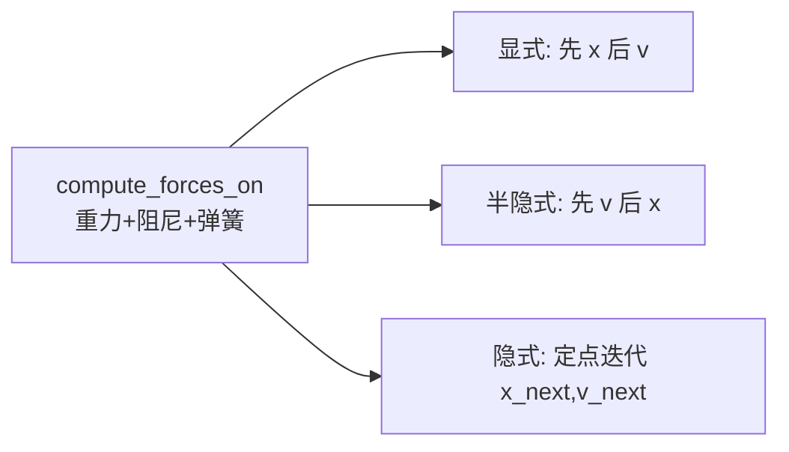

# 实验 7：质点—弹簧布料仿真（Taichi GPU）

本实验在 **Taichi** 上实现 **N×N 质点网格 + 结构弹簧** 的布料物理：对比 **显式欧拉**、**半隐式欧拉**、**隐式欧拉（定点迭代）** 三种时间积分在相同弹簧参数下的稳定性，并用 GGUI 3D 场景实时显示粒子与弹簧线框。

---

## 1. 实验目标

| 目标 | 说明 |
|------|------|
| 质点—弹簧模型 | 结构弹簧连接上下左右邻点，存储自然长度 |
| 力计算 | 重力、阻尼、胡克定律弹簧力（`atomic_add` 累加） |
| 积分器对比 | 显式易爆炸；半隐式稳定；隐式更阻尼、更稳 |
| 边界条件 | 首行两角点固定，模拟悬挂布角 |
| 交互 | 切换积分方法、暂停、重置布料 |

---

## 2. 模型与参数

与 `main.py` 一致：

| 参数 | 值 | 含义 |
|------|-----|------|
| `N` | 20 | 网格 20×20，共 400 质点 |
| `mass` | 1.0 | 质点质量 |
| `dt` | 5e-4 | 时间步长 |
| `k_s` | 10000 | 弹簧劲度 |
| `k_d` | 1.0 | 速度阻尼系数 |
| `gravity` | (0, -9.8, 0) | 重力 |
| `max_velocity` | 50 | 速度钳制，防数值发散 |

初始布匹在 `y ≈ 0.8` 水平展开；索引 `(i,0)` 且 `i∈{0, N-1}` 的角点 `is_fixed=1`。

每帧 **40 个子步**（`40 × dt ≈ 0.02 s`），保证动画速度适中。

---

## 3. 三种积分方法



| 方法 | 函数 | 特点 |
|------|------|------|
| 0 显式欧拉 | `step_explicit` | `x += v*dt` 再用旧力更新 `v`；大步长下易 **爆炸/撕裂** |
| 1 半隐式欧拉 | `step_semi_implicit` | 先 `v` 后 `x`；刚度较大时仍较稳定（**默认**） |
| 2 隐式欧拉 | `step_implicit_iter` | 对 `x_next,v_next` 做 3 次定点迭代，更阻尼、更稳 |

弹簧力在三种方法中形式相同：沿弹簧方向，大小 `k_s * (|d| - L0)`。

---

## 4. 项目结构

```
src/Work7/
├── main.py      # 初始化、三种 step kernel、GGUI 主循环
└── README.md
```

---

## 5. 环境与运行

```bash
uv sync
uv run -m src.Work7.main
```

### 操作说明（Control Panel）

| 按钮 | 作用 |
|------|------|
| Explicit Euler (Explosive) | 切换到显式积分并 **重置** 布料 |
| Semi-Implicit Euler (Stable) | 半隐式（推荐演示） |
| Implicit Euler (Damped) | 隐式定点迭代 |
| Pause / Resume | 暂停或继续仿真 |
| Reset Cloth | 重新 `init_cloth()` |

**视角**：按住 **鼠标右键** 拖动旋转相机；滚轮缩放（`track_user_inputs`）。

---

## 6. 效果展示

切换积分方法、暂停与重置布料：

<div align="center">

</div>

---

## 7. 实现细节（代码对应）

- **初始化拆分**：`init_positions` → `init_springs` → `init_spring_indices`，由 Python `init_cloth()` 顺序调用，避免 GPU 上计数与坐标不同步。
- **单 kernel 合并**：每种 `step_*` 内联 `compute_forces_on`（`ti.func`），减少每帧多次 kernel 启动开销。
- **隐式迭代**：`ti.static(range(3))` 在编译期展开 3 次力—积分循环。
- **渲染**：`scene.particles` 画质点，`scene.lines` + `spring_indices` 画弹簧。

---

## 8. 与课程知识点的对应

| 知识点 | 本仓库实现 |
|--------|------------|
| 质点—弹簧系统 | `spring_pairs` + 胡克力 |
| 显式 / 半隐式 / 隐式欧拉 | 三个 `step_*` kernel |
| 约束（固定点） | `is_fixed` 跳过积分 |
| 数值稳定性 | 速度钳制、方法对比、隐式迭代 |
| GPU 物理 | Taichi `atomic_add` 累加弹簧力 |

---

## 9. 参考文献

- Games 101 相关讲义：物理仿真与时间积分
- [Taichi GGUI / Scene](https://docs.taichi-lang.org/docs/gui)

---
