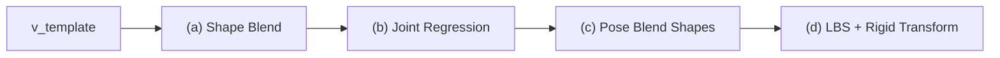

# 实验 8：LMB蒙皮
202411030025 王劭勋 25AI

本实验用 **PyTorch + smplx** 自己实现 SMPL 的线性混合蒙皮（LBS）全过程，并和 `smplx` 官方 `forward` 的顶点结果对比，确认算得对不对；同时用 Matplotlib 画出模板、变胖变瘦、姿态修正和最终网格，直观看懂 **形状混合 → 关节回归 → 姿态修正 → 蒙皮变换** 这四步。

---

## 1. 实验目标

| 目标 | 说明 |
|------|------|
| LBS 流程 | 看懂 SMPL 从 `v_template` 一路算到最终顶点的四个阶段。 |
| 自己实现 vs 官方 | 用 `smplx.lbs` 里的现成函数，自己一步步算出和官方 `forward` 一样的结果，验证实现正确。 |
| 权重可视化 | 看某一个关节对每个顶点的影响权重，以及所有关节谁在哪块区域占主导。 |
| 姿态修正 | 画出每个顶点上 `pose_offsets` 的大小，理解姿态对网格的局部修正。 |

---

## 2. 原理：SMPL LBS 的四个阶段

给定形状参数 `betas` 和姿态参数（`global_orient` + `body_pose`），SMPL 计算顶点的过程可以分成四步：



| 阶段 | 代码中的量 | 含义 |
|------|------------|------|
| (a) | `v_template` | 标准体型的模板网格；用 `lbs_weights[:, joint_id]` 着色就能看到单个关节的权重 |
| (b) | `v_shaped`, `J` | `blend_shapes(betas, shapedirs)` 得到具体体型；`vertices2joints` 从网格回归出关节位置 |
| (c) | `v_posed` | 用 `batch_rodrigues` 把轴角转成旋转矩阵，经 `posedirs` 算出 `pose_offsets`，加到 `v_shaped` 上 |
| (d) | `verts` | `batch_rigid_transform` 算出每个关节的变换矩阵 `A`，再用 `lbs_weights` 把它们加权成每个顶点自己的 `4×4` 变换 `T`，作用到顶点上 |

自己实现的部分在 `compute_manual_lbs()`；和官方结果的对比在 `compare_with_official_forward()`。

---

## 3. 项目结构

```
src/Work8/
├── main.py                          # 主程序：自己实现 LBS、和官方对比、出图
├── models/
│   └── smpl/
│       └── SMPL_NEUTRAL.pkl         # SMPL 模型（在本地，不上传至公共仓库）
├── outputs/                         # 运行后生成（默认 --out-dir ./outputs）
│   ├── stage_a_template_weights.png
│   ├── stage_b_shaped_joints.png
│   ├── stage_c_pose_offsets.png
│   ├── stage_d_lbs_result.png
│   ├── comparison_grid.png
│   ├── all_joint_weights.png
│   └── summary.txt
└── README.md
```
---

## 4. 环境与运行

依赖已写入仓库根目录 `pyproject.toml`（`torch`、`smplx`、`matplotlib`、`numpy`、`scipy` 等）。在仓库根目录：

```bash
uv sync
```

在 **`src/Work8` 相对路径** 下运行（`-m src.Work8.main` 时脚本目录为 `src/Work8/`）：

```bash
# 在仓库根目录执行（推荐）
uv run -m src.Work8.main --model-dir ./models --out-dir ./outputs --joint-id 18

# 指定可视化权重的关节编号（SMPL 共 24 个关节，默认 18 为左肘附近）
uv run -m src.Work8.main --joint-id 16 --num-betas 10
```

| 参数 | 默认 | 说明 |
|------|------|------|
| `--model-dir` | `./models` | 相对 **Work8 目录**，内含 `smpl/SMPL_NEUTRAL.pkl` |
| `--out-dir` | `./outputs` | 图像与 `summary.txt` 输出目录 |
| `--joint-id` | `18` | 阶段 (a) 中按哪个关节的 LBS 权重着色 |
| `--num-betas` | `10` | 用几个形状参数 |

---

## 5. 演示参数与输出说明

- **体型**：`build_demo_shape()` 把前几个 `betas` 设成非零，让 (b) 阶段的胖瘦变化看得明显。
- **姿态**：`build_demo_pose()` 给肩、肘、髋、膝等关节设了角度，方便观察 (c)(d) 阶段。
- **校验**：`summary.txt` 记录顶点/面片/关节数、**betas 维度**，以及自己实现的 LBS 与官方 `forward` 的平均/最大绝对误差（本机跑一次结果为 **0**）。

### 5.0 任务 1：基础信息（实测）

程序加载模型后会打印这些信息，并写进 `summary.txt`（与终端输出一致）：

| 量 | 取值 | 来源 |
|----|------|------|
| 顶点数 | **6890** | `model.v_template.shape[0]` |
| 面片数 | **13776** | `model.faces.shape[0]` |
| 关节数 | **24** | `model.lbs_weights.shape[1]` |
| betas 维度 | **10**（SMPL 标准就是 10 个形状参数） | `model.num_betas` |

终端打印：

```text
顶点数: 6890
面片数: 13776
关节数: 24
betas 维度: 10
```

### 5.1 分阶段单图

<div align="center">


</div>

<p align="center"><em>(a) 模板+权重　(b) 形状混合　(c) 姿态偏移　(d) 最终结果</em></p>

### 5.2 总览与全体关节权重

<div align="center">

</div>

<div align="center">

</div>

---

## 6. 任务清单与代码对应

下表列出实验要求的 7 个任务分别在代码里哪里、产出什么文件，全部已实现：

| 任务 | 要求 | 代码位置 | 产物 |
|------|------|----------|------|
| 1 | 加载 SMPL（`model_type='smpl'`, `gender='neutral'`），打印顶点/面片/关节数、betas 维度 | `main()` 里的 `smplx.create(...)` 和基础信息打印 | 终端输出 + `summary.txt` |
| 2(1) | 模板网格 + 单关节权重热力图 | 用 `lbs_weights[:, joint_id]` 着色，`save_single_figure` | `stage_a_template_weights.png` |
| 2(2) | 全关节主导权重分布图（可选） | `get_face_colors_from_joint_weights` | `all_joint_weights.png` |
| 3 | `v_shaped`、用 `J_regressor` 回归关节、同图显示 | `blend_shapes` + `vertices2joints` | `stage_b_shaped_joints.png` |
| 4 | 轴角转旋转矩阵、`pose_feature = R - I`、`pose_offsets`、`v_posed`、按大小着色 | `batch_rodrigues` + `posedirs` | `stage_c_pose_offsets.png` |
| 5 | 沿骨架算每个关节的变换、用 `lbs_weights` 加权、得到最终 `verts` 和关节 | `batch_rigid_transform` + `W @ A` | `stage_d_lbs_result.png` |
| 6 | 四阶段 2×2 总对比图 | `save_comparison_grid` | `comparison_grid.png` |
| 7 | 和官方 `forward` 逐顶点比较，把平均/最大误差写进 summary | `compare_with_official_forward` | `summary.txt` |

### 6.1 与课程知识点的对应

| 知识点 | 本仓库实现 |
|--------|------------|
| 线性混合蒙皮 | `compute_manual_lbs` 里的 `W @ A` 和顶点变换 |
| 形状空间 | `blend_shapes` + `shapedirs` |
| 姿态修正 | `pose_feature` × `posedirs` |
| 骨架层级 | `batch_rigid_transform` + `parents` |
| 正确性验证 | 和 `smplx` 官方 `forward` 的顶点逐个比较 |

---

## 7. 思考题解答

### 7.1 任务 2（蒙皮权重）

1. **为什么一个顶点不只受一个关节影响？**
   皮肤是连成一片的，关节附近（比如肘、膝、肩）的皮肤会被相邻两段骨头一起带动。如果每个顶点只跟一个关节，弯曲的地方就会裂开、断掉、缩成一团。让一个顶点同时受几个关节、各占一定比例地影响，过渡才平滑、动起来才自然，这就是“线性混合”的意思。

2. **如果一个顶点的权重几乎全给了某一个关节，会怎样？**
   这个顶点基本就硬跟着这一个关节走，没有过渡。在离关节远的地方（比如大腿中段、上臂中段）这样没问题；但要是发生在关节交界处，弯曲时就会出现硬棱、表面互相穿插，或者像拧糖纸一样把那一圈缩细。

3. **如果权重分布很平均，又会怎样？**
   顶点被好几个朝向不同的关节一起拉，最后是个折中结果。表面会显得软塌塌、没有骨感，关节怎么动都带不太动皮肤，整体还容易缩水、丢体积。比较好的权重是：主要由附近一两个关节说了算，相邻关节做平滑过渡。

### 7.2 任务 3（形状校正与关节回归）

1. **为什么关节位置要从形状后的网格回归，而不是固定不变？**
   关节大致是骨头的中心，应该跟着体型走。`J_regressor` 就是一个矩阵，从 `v_shaped`（已经带了体型）算出关节位置。如果关节固定不动，胖瘦不同的人就会“骨架对不上皮肤”，蒙皮时关节会戳出体外或者缩进身体里。

2. **如果人物变胖/变瘦，肩、膝、髋等关节位置会变化吗？**
   会。变胖时身体和四肢变粗，肩更宽、髋更往外、膝盖也更靠外，关节中心跟着网格一起往外移；变瘦正好相反。所以才要先定体型、再回归关节。

3. **`v_template` 与 `v_shaped` 的差别是什么？**
   `v_template` 是 β=0 的标准体型模板网格 \(\bar{T}\)；`v_shaped = v_template + blend_shapes(β, shapedirs)`，就是在模板上按 `betas` 加上形状位移，得到具体某个人的体型。

### 7.3 任务 4（姿态校正 \(B_P(\theta)\)）

1. **为什么 LBS 之前还要加姿态修正（pose corrective）？**
   只用 LBS，弯曲角度一大就会缩体积、表面塌进去。SMPL 先用 `pose_offsets = (R - I) · posedirs` 根据当前姿态对网格做一点修正，补上肌肉的鼓起和皮肤的褶皱，弯曲处才显得真实。

2. **如果去掉 `pose_offsets`，弯曲处会出现什么问题？**
   肘、膝、肩这些弯得厉害的地方会明显缩水、表面凹下去、弯折处变细，肌肉鼓起和皮肤褶皱都没了，整个人看着很“塑料”。

3. **`v_shaped` 与 `v_posed` 的本质区别是什么？**
   两个都还是站直没摆姿势的网格，骨头还没转。`v_posed = v_shaped + pose_offsets`，区别只是 `v_posed` 多加了一层跟当前姿态有关的小修正；真正把姿势摆出来要等到任务 5 做骨骼变换。

### 7.4 任务 5（完整 LBS）

1. **`J` 和 `J_transformed` 有什么区别？**
   `J` 是站直没摆姿势时、从 `v_shaped` 回归出来的关节位置；`J_transformed` 是沿着骨架（`batch_rigid_transform` 按父子关系一层层乘旋转和平移）算出来的、摆好姿势之后关节的实际位置。一个是“摆姿势之前”，一个是“摆姿势之后”。

2. **为什么最终顶点写成加权和，而不是只取最大权重关节？**
   加权和（\(v' = \sum_k w_k T_k v\)）在关节交界处能平滑过渡，不会出现硬边和撕裂；只取最大权重那个关节就相当于硬绑定，弯曲处会断开、接不上。这种按权重混合正是线性混合蒙皮的核心。

### 7.5 任务 7（一致性验证）

用**完全一样**的 `betas`、`global_orient`、`body_pose` 调用官方 `model(...)` 得到 `output.vertices`，再和自己算的 `verts` 逐个顶点求绝对差：

- **平均绝对误差（mean absolute error）**
- **最大绝对误差（max absolute error）**

两个都写进 `outputs/summary.txt`。本机跑一次误差是 **0**（因为自己实现时用的就是 `smplx.lbs` 里的同一批函数，所以结果完全一样）。

---

## 8. 参考文献

- Loper et al., *SMPL: A Skinned Multi-Person Linear Model* (SIGGRAPH Asia 2015)
- [smplx 文档与模型结构](https://github.com/vchoutas/smplx)

---
