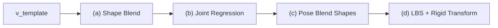
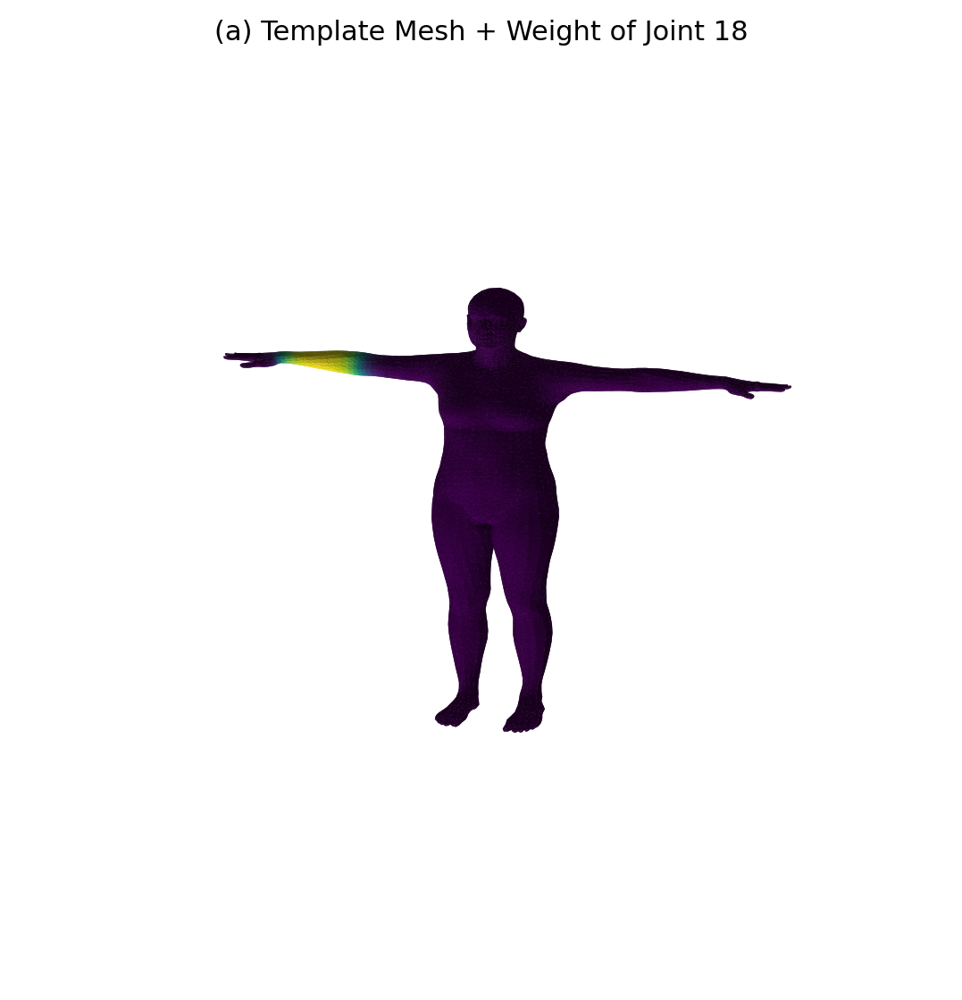
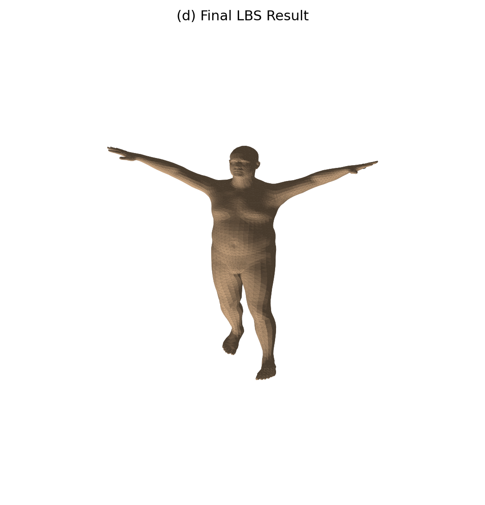
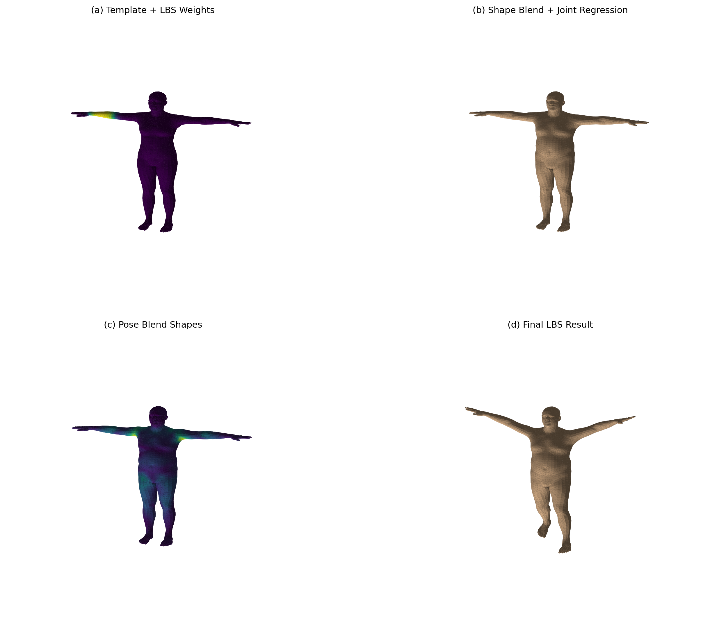

# 实验 8：SMPL 线性混合蒙皮（LBS）手写复现与可视化

本实验在 **PyTorch + smplx** 下 **分阶段手写实现** SMPL 的 Linear Blend Skinning（LBS）流程，并与 `smplx` 官方 `forward` 的顶点结果做数值对比；同时用 Matplotlib 3D 绘制模板、形变、姿态校正与最终网格，直观理解 **形状混合 → 关节回归 → 姿态混合形状 → 蒙皮变换** 四步。

---

## 1. 实验目标

| 目标 | 说明 |
|------|------|
| LBS 管线 | 理解 SMPL 从 `v_template` 到最终顶点的四阶段数据流。 |
| 手写 vs 官方 | 用 `smplx.lbs` 原语拼出与库内 `forward` 等价的计算，验证实现正确性。 |
| 权重可视化 | 观察某一关节的 per-vertex LBS 权重，以及全体关节的主导权重着色。 |
| 姿态混合形状 | 可视化 `pose_offsets` 在各顶点上的模长，理解姿态对几何的局部修正。 |

---

## 2. 理论：SMPL LBS 四阶段

SMPL 在形状参数 `betas` 与姿态参数（`global_orient` + `body_pose`）作用下，顶点更新可概括为：



| 阶段 | 代码中的量 | 含义 |
|------|------------|------|
| (a) | `v_template` | 中性模板网格；可用 `lbs_weights[:, joint_id]` 着色查看单关节权重 |
| (b) | `v_shaped`, `J` | `blend_shapes(betas, shapedirs)` 得到体型；`vertices2joints` 回归关节位置 |
| (c) | `v_posed` | 由轴角 `batch_rodrigues` 得旋转矩阵，经 `posedirs` 产生 `pose_offsets` 并加到 `v_shaped` |
| (d) | `verts` | `batch_rigid_transform` 得关节变换矩阵 `A`，用 `lbs_weights` 混合为 per-vertex 的 `4×4` 变换 `T`，作用于齐次坐标 |

手写实现见 `compute_manual_lbs()`；数值校验见 `compare_with_official_forward()`。

---

## 3. 项目结构

```
src/Work8/
├── main.py                          # 主程序：LBS 复现、对比、出图
├── models/
│   └── smpl/
│       └── SMPL_NEUTRAL.pkl         # SMPL 中性模型（需自行按许可放置）
├── outputs/                         # 运行后生成（默认 --out-dir ./outputs）
│   ├── stage_a_template_weights.png
│   ├── stage_b_shaped_joints.png
│   ├── stage_c_pose_offsets.png
│   ├── stage_d_lbs_result.png
│   ├── comparison_grid.png
│   ├── all_joint_weights.png
│   └── summary.txt
└── README.md
```

**模型文件**：目录结构须为 `models/smpl/SMPL_NEUTRAL.pkl`（与 `smplx.create(model_path=..., model_type="smpl")` 约定一致）。请从 [SMPL 官网](https://smpl.is.tue.mpg.de/) 下载并遵守其许可，勿将模型提交到公开仓库（若课程已提供，按助教路径放置即可）。

**旧版 pkl 与 chumpy**：官方 `.pkl` 可能依赖已废弃的 `chumpy`。本仓库通过 `install_chumpy_pickle_shim()` 注入最小 pickle 兼容层，**无需**单独安装 chumpy。

---

## 4. 环境与运行

依赖已写入仓库根目录 `pyproject.toml`（`torch`、`smplx`、`matplotlib`、`numpy`、`scipy` 等）。在仓库根目录：

```bash
uv sync
```

在 **`src/Work8` 相对路径语义** 下运行（`-m src.Work8.main` 时脚本目录为 `src/Work8/`）：

```bash
# 在仓库根目录执行（推荐）
uv run -m src.Work8.main --model-dir ./models --out-dir ./outputs --joint-id 18

# 指定可视化权重的关节编号（SMPL 共 24 个关节，默认 18 为左肘附近）
uv run -m src.Work8.main --joint-id 16 --num-betas 10
```

| 参数 | 默认 | 说明 |
|------|------|------|
| `--model-dir` | `./models` | 相对 **Work8 目录**，内含 `smpl/SMPL_NEUTRAL.pkl` |
| `--out-dir` | `./outputs` | 图像与 `summary.txt` 输出目录 |
| `--joint-id` | `18` | 阶段 (a) 中按该关节 LBS 权重着色的关节索引 |
| `--num-betas` | `10` | 使用的 shape 主成分个数 |

**常见路径错误**：不要使用 `--model-dir ./Work8/models`。在 `-m src.Work8.main` 下会解析成 `src/Work8/Work8/models`（不存在），`smplx` 可能报错 `Unknown model type models`。应使用 `./models` 或绝对路径 `D:\...\src\Work8\models`。

---

## 5. 演示参数与输出说明

- **体型**：`build_demo_shape()` 对前几个 `betas` 设非零，使 (b) 阶段体型变化明显。
- **姿态**：`build_demo_pose()` 对肩、肘、髋、膝等关节设置轴角，便于观察 (c)(d) 阶段。
- **校验**：`summary.txt` 记录顶点/面片/关节数，以及手写 LBS 与官方 `forward` 的 mean/max 绝对误差（本机一次运行为 **0**）。

### 5.1 分阶段单图

<div align="center">




</div>

<p align="center"><em>(a) 模板+权重　(b) 形状混合　(c) 姿态偏移　(d) 最终结果</em></p>

### 5.2 总览与全体关节权重

<div align="center">

</div>

<div align="center">

</div>

---

## 6. 与课程知识点的对应

| 知识点 | 本仓库实现 |
|--------|------------|
| 线性混合蒙皮 | `compute_manual_lbs` 中 `W @ A` 与齐次顶点变换 |
| 形状空间 | `blend_shapes` + `shapedirs` |
| 姿态混合形状 | `pose_feature` × `posedirs` |
| 骨架层级 | `batch_rigid_transform` + `parents` |
| 正确性验证 | 与 `smplx` 官方 `forward` 顶点逐元素对比 |

---

## 7. 参考文献

- Loper et al., *SMPL: A Skinned Multi-Person Linear Model* (SIGGRAPH Asia 2015)
- [smplx 文档与模型结构](https://github.com/vchoutas/smplx)

---
